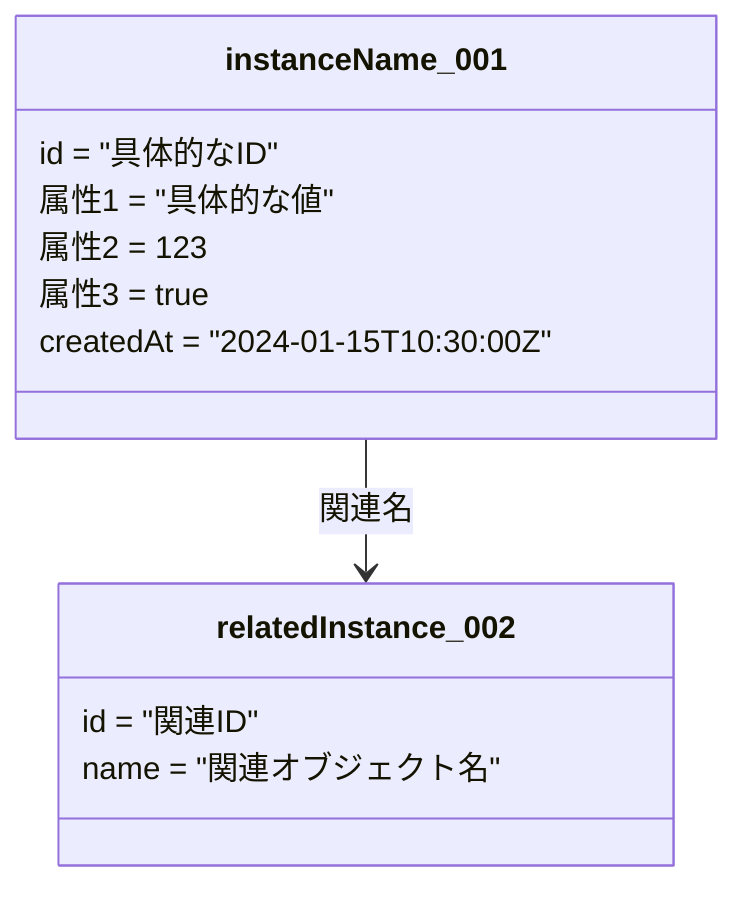
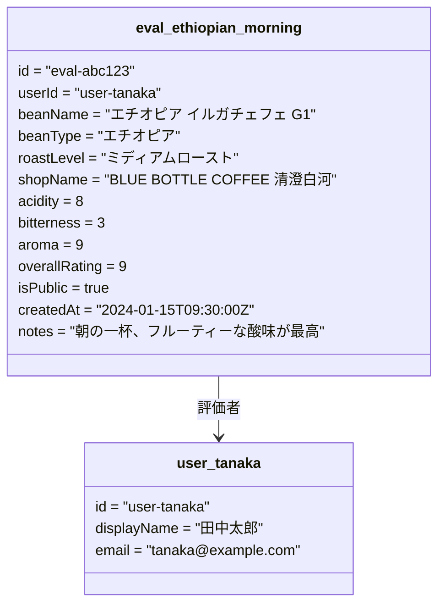
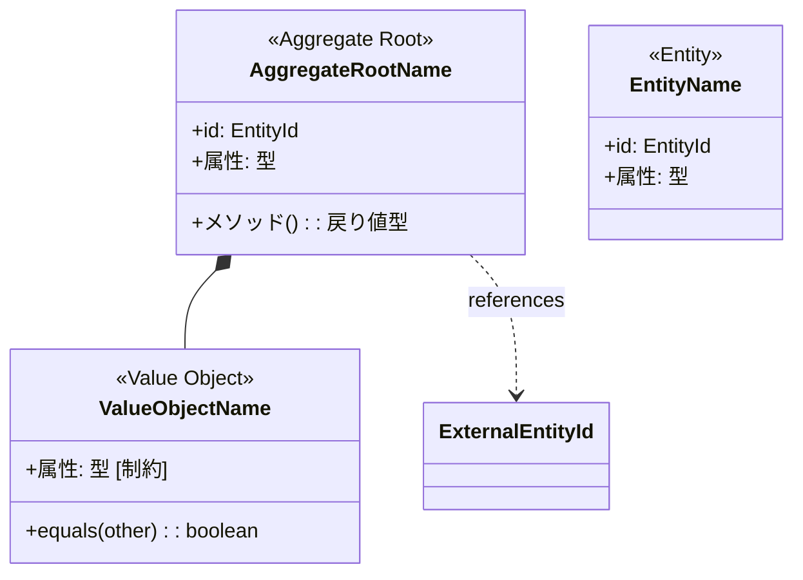
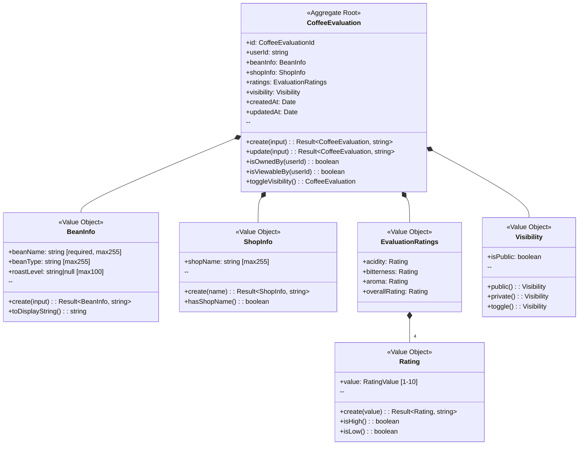
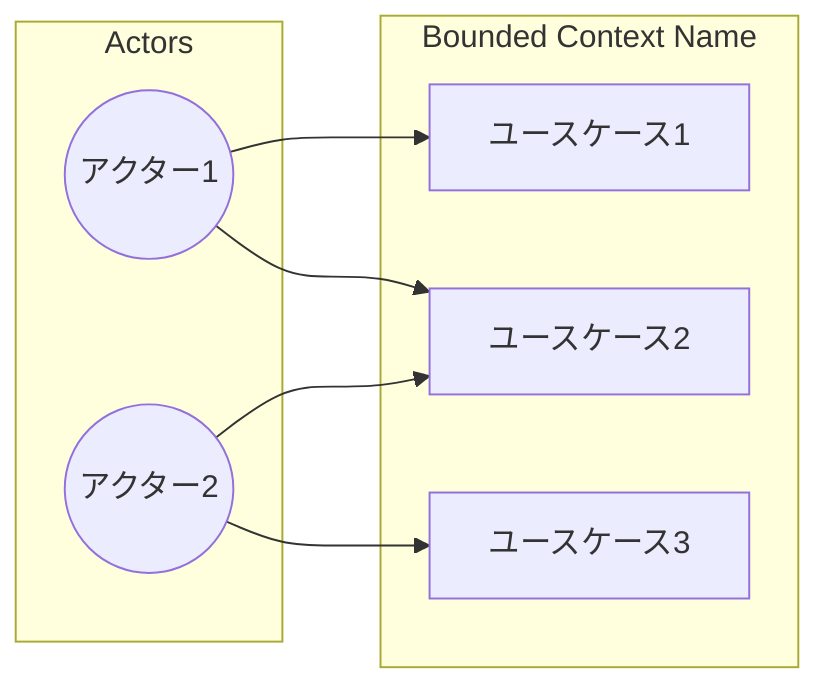
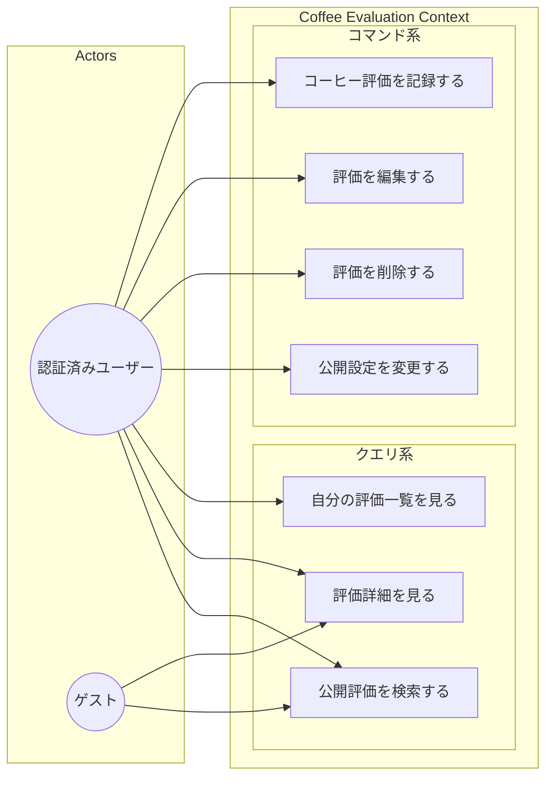
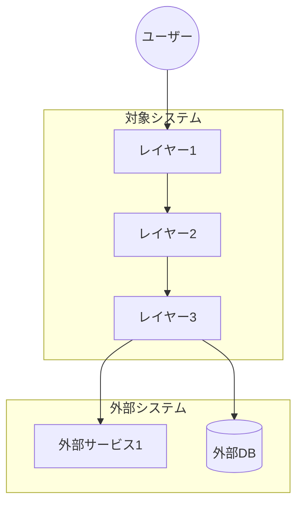
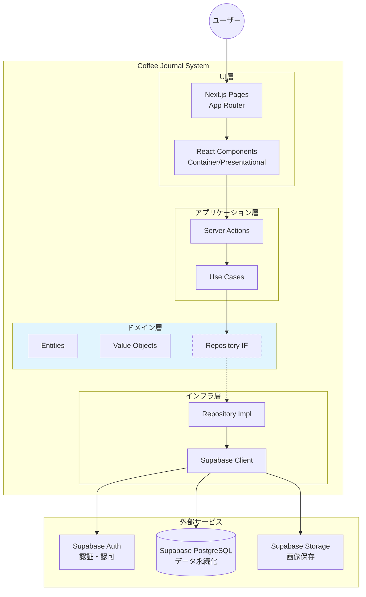
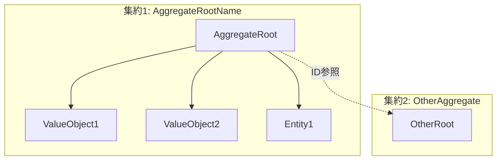
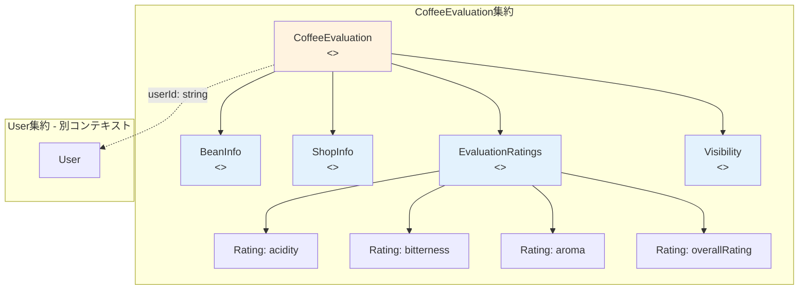

# sudo-modeling テンプレート集

## 1. Object Diagram テンプレート

具体的なインスタンスを表現するためのテンプレート。

### コーヒー評価の例

---

## 2. Domain Model Diagram テンプレート

クラス、値オブジェクト、集約を表現するためのテンプレート。

### コーヒー評価ドメインモデルの例

---

## 3. Use Case Diagram テンプレート

アクターとユースケースの関係を表現するためのテンプレート。

### コーヒー評価ユースケースの例

---

## 4. System Context Diagram テンプレート

システム境界と外部システムとの関係を表現するためのテンプレート。

### コーヒー日記システムコンテキストの例

---

## 5. 集約境界図テンプレート

集約の内部構造と外部参照を明示するためのテンプレート。

### コーヒー評価集約の例

---

## 使用上の注意

1. **ステレオタイプの使用**: `<<Aggregate Root>>`, `<<Entity>>`, `<<Value Object>>` を明示する
2. **制約の記載**: `[required]`, `[max255]`, `[1-10]` など制約を属性に追記
3. **関連の種類**:
   - `*--`: コンポジション（所有関係、ライフサイクル共有）
   - `o--`: 集約（所有関係、ライフサイクル独立）
   - `-->`: 依存（一時的な使用）
   - `..>`: 参照（ID参照、弱い関連）
