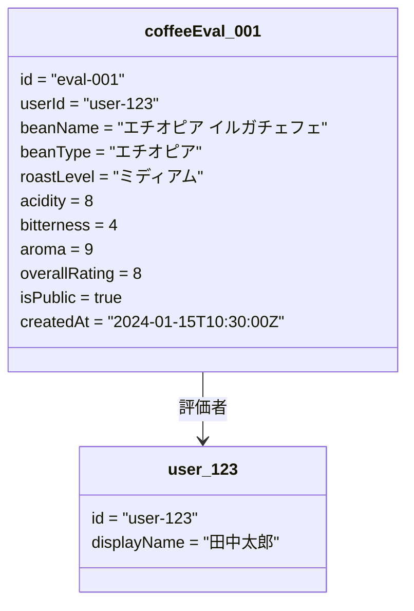
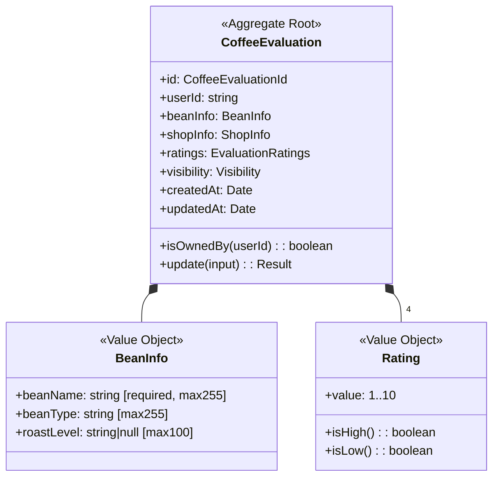
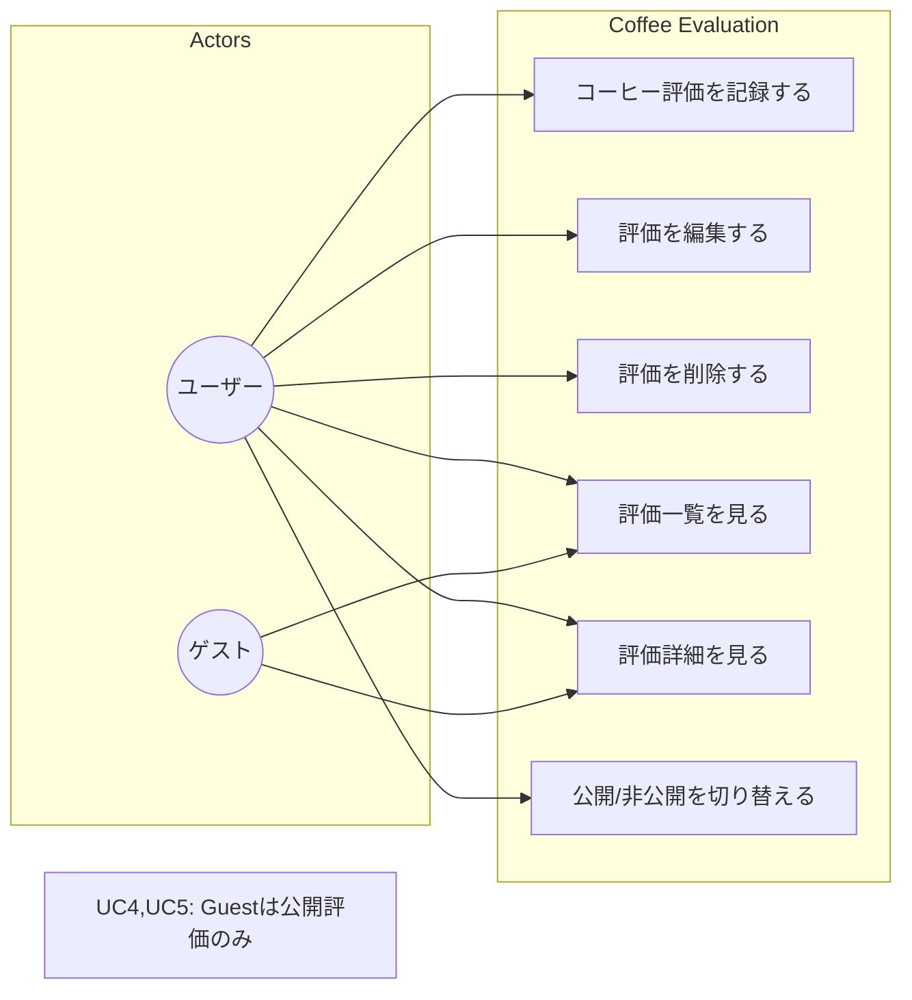
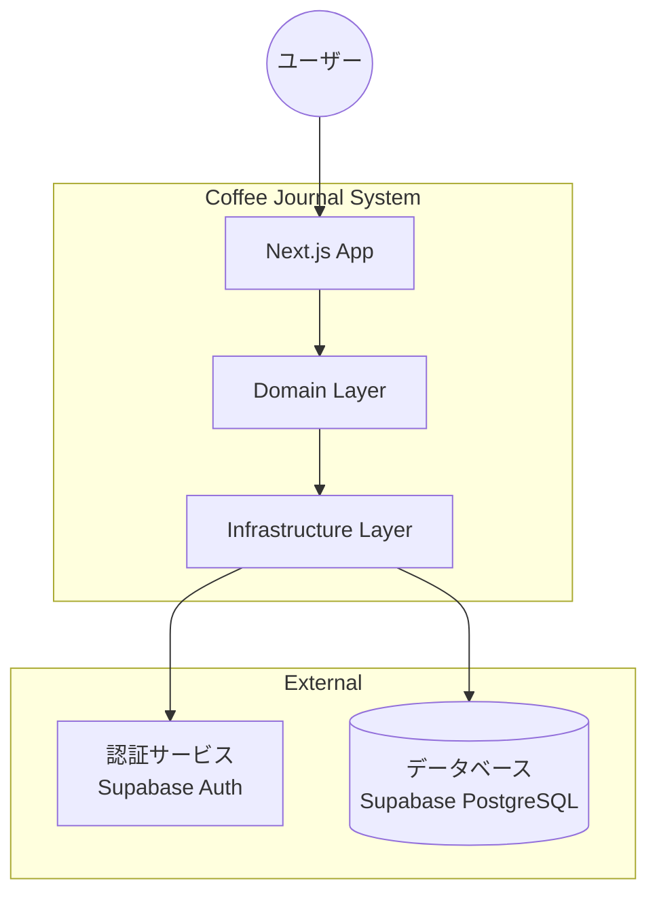

# sudo-modeling ワークフロー

## 概要

sudoモデリングは4つの図（S-U-D-O）を使ったドメインモデリング手法です。
**重要**: Object Diagram（具体例）から始めることで、抽象化の誤りを防ぎます。

```
推奨順序: O → D → U → S
         ↑         ↓
         ←── 反復 ←──
```

---

## Phase 1: Object Diagram（具体的なインスタンス）

**目的**: ドメインの具体的な状態を表現する

### 手順

1. **典型的なシナリオを選択**
   - ユーザーが最もよく行う操作
   - エッジケースではなくハッピーパス

2. **具体的なインスタンスを作成**
   - 実際のデータ値を使用
   - 「ユーザーA」ではなく「田中太郎」のように具体的に

3. **関連を線で結ぶ**
   - どのオブジェクトがどのオブジェクトを参照しているか

### 出力例



### 確認ポイント
- [ ] 全ての必要な属性が含まれているか？
- [ ] 値の具体例は現実的か？
- [ ] 関連は正しく表現されているか？

---

## Phase 2: Domain Model Diagram（ドメインモデル）

**目的**: Object Diagramから抽象的なクラス構造を抽出する

### 手順

1. **オブジェクトからクラスを抽出**
   - 共通のパターンを見つける
   - 属性の型と制約を定義

2. **値オブジェクトを識別**
   - 不変であるべきデータ
   - 単独では意味を持たないデータ

3. **集約境界を定義**
   - 同時に更新されるデータのグループ
   - 集約ルートを特定

4. **ビジネスルールを注釈**
   - バリデーションルール
   - 不変条件

### 出力例



### 確認ポイント
- [ ] 全てのObject Diagramの属性がカバーされているか？
- [ ] 値オブジェクトとエンティティの区別は適切か？
- [ ] 集約境界は明確か？

---

## Phase 3: Use Case Diagram（システム振る舞い）

**目的**: ユーザーがシステムで何ができるかを定義する

### 手順

1. **アクターを特定**
   - プライマリユーザー
   - 外部システム

2. **ユースケースを列挙**
   - ドメインモデルの操作から導出
   - CRUDを超えた業務目線で命名

3. **関連を定義**
   - どのアクターがどのユースケースを実行するか
   - ユースケース間の依存関係

### 出力例



### 確認ポイント
- [ ] 全てのユーザー要件がカバーされているか？
- [ ] アクセス制御は明確か？
- [ ] ドメインモデルの操作と対応しているか？

---

## Phase 4: System Context Diagram（システム境界）

**目的**: システム全体の境界と外部との関係を定義する

### 手順

1. **システム境界を定義**
   - 何がシステムの一部で、何が外部か

2. **外部システムを特定**
   - 認証プロバイダ
   - データベース
   - 外部API

3. **データフローを定義**
   - 各境界でやり取りされるデータ

### 出力例



### 確認ポイント
- [ ] システム境界は明確か？
- [ ] 外部依存が全て識別されているか？
- [ ] データフローは理解しやすいか？

---

## 反復と洗練

各フェーズ完了後に確認:

1. **整合性チェック**
   - Object DiagramとDomain Modelの属性は一致しているか？
   - Use CaseとDomain Modelの操作は対応しているか？

2. **フィードバックループ**
   - 新しい発見があれば前のフェーズに戻る
   - ステークホルダーと確認し、認識のずれを修正

3. **完了条件**
   - 4つの図が整合している
   - 全てのビジネスルールが表現されている
   - 集約境界が明確に定義されている
