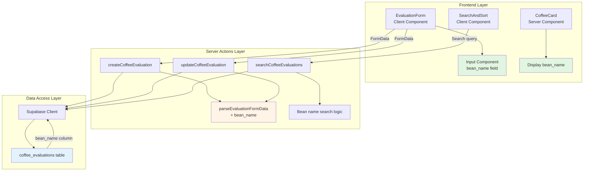

# Design Document

## Overview

「豆の名前」入力機能は、既存の `coffee_evaluations` テーブルに `bean_name` カラムを追加し、フロントエンドのフォーム、表示、検索機能を拡張します。この設計は、既存のアーキテクチャパターン（Container/Presentational、Server Components First）を維持しながら、最小限の変更で新機能を提供します。

**影響範囲:**
- データベース: 1つのマイグレーションファイル（`bean_name` カラム追加）
- 型定義: 2ファイル（`database.types.ts`, `coffee.ts`）
- Server Actions: 1ファイル（`lib/actions/coffee.ts`）
- API Layer: 検索機能の拡張（`lib/api/coffee.ts`）
- UI Components: 4ファイル（フォーム、カード、詳細ビュー、検索）

## Steering Document Alignment

### Technical Standards (tech.md)

この設計は以下の技術標準に準拠します:

- **Next.js App Router with Server Components**: すべての新規コンポーネントは Server Components を優先し、必要な場合のみ Client Components を使用
- **TypeScript Strict Mode**: すべての型定義を厳格に管理し、`bean_name` フィールドの型安全性を確保
- **Server Actions for Mutations**: フォーム送信には既存の Server Actions パターンを使用（`createCoffeeEvaluation`, `updateCoffeeEvaluation`）
- **Supabase PostgreSQL**: `coffee_evaluations` テーブルに `bean_name VARCHAR(255) NULL` カラムを追加
- **TDD Approach**: すべての変更にテストを追加（Red-Green-Refactor サイクル）

### Project Structure (structure.md)

この実装は以下のプロジェクト構造パターンに従います:

- **Container/Presentational Pattern**:
  - データ取得は `_containers/` で実施
  - UI表示は `_components/` で実施
- **Colocation**:
  - テストは対象ファイルの隣に配置（例: `evaluation-form.test.tsx`）
- **File Organization**:
  - `lib/actions/coffee.ts` を拡張（新ファイル作成なし）
  - `lib/types/coffee.ts` を更新
  - コンポーネントは既存のディレクトリ構造を維持

## Code Reuse Analysis

### Existing Components to Leverage

- **`Input` コンポーネント** (`components/ui/Input.tsx`):
  - 「豆の名前」フィールドに再利用
  - 既存のスタイル、バリデーション、エラー表示機能をそのまま利用

- **`EvaluationForm` コンポーネント** (`app/(app)/coffee/_components/evaluation-form.tsx`):
  - 既存のフォーム構造を拡張
  - 新しい `beanName` state と入力フィールドを追加
  - `buildFormData()` 関数に `bean_name` を追加

- **`CoffeeCard` コンポーネント** (`app/(app)/coffee/_components/list/card.tsx`):
  - 豆の名前表示を追加（条件付きレンダリング）

- **`CoffeeListView` コンポーネント** (`app/(app)/coffee/_components/list/view.tsx`):
  - データパススルーのみ（変更なし、Card が表示を担当）

- **`SearchAndSort` コンポーネント** (`app/(app)/coffee/_components/list/search-and-sort.tsx`):
  - 検索ロジックは Server Side で実施されるため、UI変更なし

### Integration Points

- **`coffee_evaluations` テーブル** (Supabase PostgreSQL):
  - 新カラム: `bean_name VARCHAR(255) NULL`
  - 既存データへの影響なし（NULL許可）
  - RLS ポリシーは自動的に新カラムにも適用

- **Server Actions** (`lib/actions/coffee.ts`):
  - `parseEvaluationFormData()`: `bean_name` フィールドを追加
  - `createCoffeeEvaluation()`: FormData から `bean_name` を取得して挿入
  - `updateCoffeeEvaluation()`: 更新時に `bean_name` を含める
  - バリデーションは不要（任意フィールド、最大長はDB側で制約）

- **API Layer** (`lib/api/coffee.ts`):
  - 検索関数を拡張: `bean_name` を検索対象に追加
  - 型定義の更新のみで、ロジック変更は最小限

- **Type Definitions**:
  - `database.types.ts`: Supabase CLI で自動生成（`supabase gen types`）
  - `coffee.ts`: `CoffeeEvaluationFormInput` に `bean_name?: string` を追加

## Architecture

この機能は **レイヤードアーキテクチャ** を採用し、関心の分離を維持します:

```
User Interaction Layer (Client Component)
    ↓
Presentation Layer (Server Component)
    ↓
Business Logic Layer (Server Actions)
    ↓
Data Access Layer (Supabase Client)
    ↓
Database Layer (PostgreSQL)
```

### Modular Design Principles

- **Single File Responsibility**:
  - マイグレーションファイルは `bean_name` カラム追加のみ
  - 型定義ファイルは型の更新のみ
  - 各コンポーネントは1つの責務（フォーム、カード、検索）

- **Component Isolation**:
  - `Input` コンポーネントは独立して再利用可能
  - `EvaluationForm` は `bean_name` state を内部管理
  - 親コンポーネントへの props drilling なし

- **Service Layer Separation**:
  - データ取得: `lib/api/coffee.ts` (cache() でメモ化)
  - ビジネスロジック: `lib/actions/coffee.ts` (Server Actions)
  - プレゼンテーション: `app/(app)/coffee/_components/`

- **Utility Modularity**:
  - 型定義は `lib/types/coffee.ts` で一元管理
  - バリデーション関数は既存のものを再利用

### Architecture Diagram



## Components and Interfaces

### Component 1: Database Migration

- **Purpose:** `coffee_evaluations` テーブルに `bean_name` カラムを追加
- **File:** `supabase/migrations/YYYYMMDDHHMMSS_add_bean_name_to_coffee_evaluations.sql`
- **SQL:**
  ```sql
  ALTER TABLE coffee_evaluations
  ADD COLUMN bean_name VARCHAR(255) NULL;
  ```
- **Dependencies:** 既存の `coffee_evaluations` テーブル
- **Reuses:** なし（新規マイグレーション）

### Component 2: Type Definitions Update

- **Purpose:** `bean_name` フィールドの型定義を追加
- **Files:**
  - `lib/types/database.types.ts`: Supabase CLI で自動生成（手動編集不要）
  - `lib/types/coffee.ts`: Form Input 型に `bean_name` を追加
- **Interfaces:**
  ```typescript
  // lib/types/coffee.ts
  export interface CoffeeEvaluationFormInput {
    shop_name: string
    bean_type: string
    bean_name?: string  // 新規追加（任意）
    roast_level: string | null
    acidity: number
    bitterness: number
    aroma: number
    overall_rating: number
    is_public: boolean
  }

  export interface CoffeeEvaluationEditFormInput {
    shop_name?: string
    bean_type?: string
    bean_name?: string  // 新規追加（任意）
    roast_level?: string | null
    acidity?: number
    bitterness?: number
    aroma?: number
    overall_rating?: number
    is_public?: boolean
  }
  ```
- **Dependencies:** `database.types.ts`
- **Reuses:** 既存の型定義パターン

### Component 3: Server Actions Extension

- **Purpose:** FormData parsing と DB操作に `bean_name` を統合
- **File:** `lib/actions/coffee.ts`
- **Interfaces:**
  ```typescript
  // ParsedEvaluationData インターフェースを拡張
  interface ParsedEvaluationData {
    shop_name: string
    bean_type: string
    bean_name: string | null  // 新規追加
    roast_level: string | null
    acidity: number
    bitterness: number
    aroma: number
    overall_rating: number
    is_public: boolean
  }

  // parseEvaluationFormData() を拡張
  function parseEvaluationFormData(formData: FormData): ParsedEvaluationData {
    const shopName = getStringField(formData, 'shop_name').trim()
    const beanType = getStringField(formData, 'bean_type').trim()
    const beanName = getStringField(formData, 'bean_name').trim()  // 新規
    const roastLevel = getStringField(formData, 'roast_level').trim()

    return {
      shop_name: shopName,
      bean_type: beanType,
      bean_name: beanName || null,  // 空文字列は NULL に変換
      roast_level: roastLevel || null,
      // ... 他のフィールド
    }
  }

  // createCoffeeEvaluation() と updateCoffeeEvaluation() で使用
  await supabase.from('coffee_evaluations').insert({
    user_id: user.id,
    shop_name: data.shop_name,
    bean_type: data.bean_type,
    bean_name: data.bean_name,  // 新規追加
    // ... 他のフィールド
  })
  ```
- **Dependencies:** `createClient` (Supabase), 型定義
- **Reuses:** 既存の `getStringField()`, `validateEvaluationData()` 関数

### Component 4: EvaluationForm Component Extension

- **Purpose:** 「豆の名前」入力フィールドを追加
- **File:** `app/(app)/coffee/_components/evaluation-form.tsx`
- **Interfaces:**
  ```typescript
  // State に beanName を追加
  const [beanName, setBeanName] = useState(initialData?.bean_name ?? '')

  // buildFormData() を拡張
  const buildFormData = () => {
    if (!formRef.current) return new FormData()
    const formData = new FormData(formRef.current)

    formData.set('shop_name', shopName.trim())
    formData.set('bean_type', beanType.trim())
    formData.set('bean_name', beanName.trim())  // 新規追加
    formData.set('roast_level', roastLevel.trim())
    // ... 他のフィールド
    return formData
  }

  // JSX に Input フィールドを追加
  <div className="grid gap-4 md:grid-cols-2">
    <Input
      label="店名"
      value={shopName}
      onChange={(e) => setShopName(e.target.value)}
      error={errors.shop_name}
    />
    <Input
      label="豆の種類"
      value={beanType}
      onChange={(e) => setBeanType(e.target.value)}
      error={errors.bean_type}
    />
    <Input
      label="豆の名前（任意）"
      placeholder="例: エチオピア イルガチェフェ G1"
      value={beanName}
      onChange={(e) => setBeanName(e.target.value)}
    />
    {/* 焙煎度セレクト */}
  </div>
  ```
- **Dependencies:** `Input` コンポーネント, Server Actions
- **Reuses:** 既存の `Input` コンポーネント、フォームパターン

### Component 5: CoffeeCard Display Extension

- **Purpose:** カード表示に「豆の名前」を追加
- **File:** `app/(app)/coffee/_components/list/card.tsx`
- **Interfaces:**
  ```typescript
  // JSX に条件付きレンダリングを追加
  <div className="space-y-2">
    <h3 className="text-lg font-semibold">{evaluation.shop_name}</h3>
    <p className="text-sm text-neutral-600">
      {evaluation.bean_type}
      {evaluation.bean_name && ` - ${evaluation.bean_name}`}
    </p>
    {/* 既存の評価表示 */}
  </div>
  ```
- **Dependencies:** `CoffeeEvaluation` 型
- **Reuses:** 既存のカードレイアウト、スタイル

### Component 6: Evaluation Detail View Extension

- **Purpose:** 詳細ページに「豆の名前」を表示
- **File:** `app/(app)/coffee/[id]/_components/evaluation/view.tsx`
- **Interfaces:**
  ```typescript
  // JSX に表示を追加
  <dl className="grid grid-cols-1 gap-4 sm:grid-cols-2">
    <div>
      <dt className="text-sm font-medium text-neutral-500">店名</dt>
      <dd className="mt-1 text-sm text-neutral-900">{evaluation.shop_name}</dd>
    </div>
    <div>
      <dt className="text-sm font-medium text-neutral-500">豆の種類</dt>
      <dd className="mt-1 text-sm text-neutral-900">{evaluation.bean_type}</dd>
    </div>
    {evaluation.bean_name && (
      <div>
        <dt className="text-sm font-medium text-neutral-500">豆の名前</dt>
        <dd className="mt-1 text-sm text-neutral-900">{evaluation.bean_name}</dd>
      </div>
    )}
    {/* 既存の焙煎度、評価表示 */}
  </dl>
  ```
- **Dependencies:** `CoffeeEvaluation` 型
- **Reuses:** 既存の description list パターン

### Component 7: Search Function Extension

- **Purpose:** 検索機能に `bean_name` を追加
- **File:** `lib/api/coffee.ts` (既存の検索関数を拡張)
- **Interfaces:**
  ```typescript
  // 検索クエリに bean_name を追加
  export const searchCoffeeEvaluations = cache(async (params: CoffeeEvaluationSearchParams) => {
    const supabase = await createClient()
    let query = supabase
      .from('coffee_evaluations')
      .select('*')

    if (params.search) {
      query = query.or(
        `shop_name.ilike.%${params.search}%,` +
        `bean_type.ilike.%${params.search}%,` +
        `bean_name.ilike.%${params.search}%,` +  // 新規追加
        `roast_level.ilike.%${params.search}%`
      )
    }

    // ... ソートとフィルタリング
    const { data, error } = await query
    if (error) throw new Error(error.message)
    return data
  })
  ```
- **Dependencies:** Supabase client, 型定義
- **Reuses:** 既存の検索ロジック、`cache()` パターン

## Data Models

### CoffeeEvaluation (拡張)

```typescript
// lib/types/database.types.ts (Supabase自動生成)
export type CoffeeEvaluation = {
  id: string
  user_id: string
  shop_name: string
  bean_type: string
  bean_name: string | null  // 新規追加
  roast_level: string | null
  acidity: number
  bitterness: number
  aroma: number
  overall_rating: number
  is_public: boolean
  created_at: string
  updated_at: string
}
```

### Database Schema Change

```sql
-- Migration: add bean_name column
ALTER TABLE coffee_evaluations
ADD COLUMN bean_name VARCHAR(255) NULL;

-- No index needed (optional field, not frequently searched alone)
-- Search will use existing indexes + sequential scan for bean_name
```

**設計判断:**
- `NULL` 許可: 既存データへの影響なし、後方互換性を維持
- `VARCHAR(255)`: 商品名として十分な長さ
- インデックス不要: 検索は `shop_name` と `bean_type` と組み合わせて使用されるため、個別インデックスは不要

## Error Handling

### Error Scenarios

1. **フィールド長超過 (> 255文字)**:
   - **Handling:** データベース制約エラーをキャッチし、ユーザーフレンドリーなメッセージを表示
   - **User Impact:** フォームに「豆の名前は255文字以内で入力してください」とエラー表示
   - **Implementation:** Server Action でエラーをキャッチし、`{ error: string }` を返す

2. **マイグレーション失敗**:
   - **Handling:** Supabase CLI がエラーを表示、開発者がロールバック
   - **User Impact:** なし（開発時のみ）
   - **Implementation:** マイグレーションは冪等性を保証（`ADD COLUMN IF NOT EXISTS` は使わず、手動確認）

3. **検索時のデータベースエラー**:
   - **Handling:** API層でエラーをキャッチし、エラー境界でユーザーに通知
   - **User Impact:** 「検索中にエラーが発生しました」メッセージ表示
   - **Implementation:** 既存のエラーハンドリング機構（`error.tsx`）を活用

4. **NULL値の表示**:
   - **Handling:** 条件付きレンダリングで `bean_name` が NULL の場合は非表示
   - **User Impact:** 「豆の名前」セクションが表示されない
   - **Implementation:** `{evaluation.bean_name && <div>...</div>}` パターン

## Testing Strategy

### Unit Testing

**対象ファイル:**
- `lib/actions/coffee.test.ts`: Server Actions のテスト拡張
- `lib/types/coffee.test.ts`: 型定義のバリデーションテスト（既存）
- `app/(app)/coffee/_components/evaluation-form.test.tsx`: フォームコンポーネントのテスト拡張

**テストケース:**
1. `parseEvaluationFormData()` が `bean_name` を正しく抽出する
2. 空文字列の `bean_name` が NULL に変換される
3. `createCoffeeEvaluation()` が `bean_name` を含めて保存する
4. `updateCoffeeEvaluation()` が `bean_name` を更新する
5. EvaluationForm が `bean_name` state を管理する
6. EvaluationForm が `bean_name` を FormData に含める

### Integration Testing

**対象ファイル:**
- `app/(app)/coffee/__tests__/integration/coffee-flows.test.tsx`: エンドツーエンドフローテスト拡張
- `app/(app)/coffee/__tests__/integration/search-sort-flows.test.tsx`: 検索機能テスト拡張

**テストフロー:**
1. **作成フロー with bean_name**:
   - ユーザーがフォームに「豆の名前」を入力
   - 保存後、詳細ページで「豆の名前」が表示される
2. **作成フロー without bean_name**:
   - 「豆の名前」を空欄で保存
   - 詳細ページで「豆の名前」セクションが非表示
3. **編集フロー**:
   - 既存の評価に「豆の名前」を追加
   - 更新後、正しく表示される
4. **検索フロー**:
   - 「豆の名前」で検索
   - 該当する評価が表示される

### End-to-End Testing (手動)

**ユーザーシナリオ:**
1. 新規評価作成時に「エチオピア イルガチェフェ G1」を入力
2. 一覧ページで「豆の種類 - 豆の名前」形式で表示されることを確認
3. 詳細ページで「豆の名前」セクションが表示されることを確認
4. 検索で「イルガ」と入力し、該当評価が表示されることを確認
5. 編集ページで「豆の名前」を変更し、更新されることを確認

**回帰テスト:**
- 既存の評価（`bean_name` が NULL）が正常に表示される
- 既存の検索機能が動作する（`bean_name` なしでも検索可能）
- 既存のフォーム機能（店名、豆の種類など）が正常動作する
