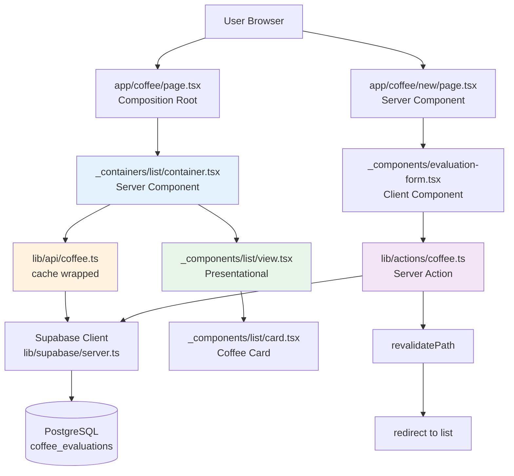

# Design Document - Coffee Evaluation Feature

## Overview

コーヒー評価機能は、Next.js 15 App RouterとSupabaseを使用したフルスタックの評価記録システムです。Server Components Firstアーキテクチャに基づき、Container/Presentationalパターンで実装します。

**Key Design Principles:**
- Server Components Firstでデータフェッチング
- Container/Presentationalパターンによる関心の分離
- Request Memoization（cache()）で重複リクエスト防止
- Modern Artisanal UIデザイン（コーヒー文化の暖かみと上質さ）
- レスポンシブデザイン（モバイルファースト）

## Steering Document Alignment

### Technical Standards (tech.md)

**Tech Stack Compliance:**
- Next.js 15.1.3 App Router with Server Components
- React 19 with RSC support
- TypeScript 5.x for type safety
- Supabase for PostgreSQL database, authentication, and Row Level Security
- Tailwind CSS 3.4.1 for styling
- Server Actions for mutations

**Architecture Pattern:**
- Server Components First（tech.mdのPrinciple #1）
- Server Actions for form submissions（tech.mdのDecision #3）
- Supabase SSR for authentication（tech.mdのDecision #2）

### Project Structure (structure.md)

**Directory Organization:**
```
app/(app)/coffee/
  ├── page.tsx                        # Composition root
  ├── _containers/
  │   └── list/container.tsx         # Server Component: data fetching
  ├── _components/
  │   ├── list/
  │   │   ├── view.tsx               # Presentational: list display
  │   │   ├── card.tsx               # Coffee card component
  │   │   ├── search-and-sort.tsx    # Client Component: search/filter
  │   │   └── rating-bar.tsx         # Rating visualization
  │   └── shared/
  │       └── rating-stars.tsx       # Shared rating display
  ├── new/
  │   ├── page.tsx                   # New evaluation page
  │   └── _components/
  │       ├── evaluation-form.tsx    # Client Component: form
  │       └── coffee-slider.tsx      # Custom slider component
  └── [id]/
      ├── page.tsx                   # Detail page
      ├── _containers/
      │   └── evaluation/container.tsx
      └── _components/
          └── evaluation/view.tsx

lib/
  ├── api/
  │   └── coffee.ts                  # Data fetching with cache()
  ├── actions/
  │   └── coffee.ts                  # Server Actions (CRUD)
  ├── types/
  │   └── coffee.ts                  # Coffee-specific types
  └── utils/
      └── constants.ts               # Roast levels, etc.
```

**Following structure.md patterns:**
- `_containers/` for Server Components (data fetching)
- `_components/` for Presentational components
- `lib/api/` for cached data fetching functions
- `lib/actions/` for Server Actions
- Co-located tests with source files

## Code Reuse Analysis

### Existing Components to Leverage

- **`components/ui/Button.tsx`**: 評価フォームの送信・キャンセルボタンで使用
- **`components/ui/Input.tsx`**: 店名、豆の種類、焙煎度の入力フィールドで使用
- **`lib/supabase/server.ts`**: Server ComponentsでのSupabaseクライアント取得
- **`lib/actions/auth.ts`**: 認証パターンを参考に、coffee.tsのServer Actionsを実装

### New Components to Create

- **`components/ui/Slider.tsx`**: 評価スライダー（1-10の範囲）
- **`app/(app)/coffee/_components/list/card.tsx`**: コーヒー評価カード
- **`app/(app)/coffee/_components/shared/rating-stars.tsx`**: 星評価表示

### Integration Points

- **Supabase Authentication**: 既存のauth flowと統合、user_idで評価を関連付け
- **Database Schema**: 新しいテーブル`coffee_evaluations`と`user_profiles`を追加
- **Middleware**: 既存のmiddleware.tsで認証チェック（変更なし）
- **Layout**: `app/(app)/layout.tsx`にナビゲーションリンク追加

## Architecture

### Architectural Decisions

#### Decision: Dedicated Page Routes for Create/Edit Forms

**Context:**
評価の作成・編集にあたり、以下の2つの選択肢を検討しました：
- **Option A**: 専用ページルート（`/coffee/new/page.tsx`, `/coffee/[id]/edit/page.tsx`）
- **Option B**: コンポーネント直接配置（モーダルまたはインライン）

**Decision: Option A - 専用ページルートを採用** ✅

**Rationale:**

1. **Next.js App Router の標準パターン**:
   - File-based routing はNext.jsの中核設計思想
   - CRUD操作は独立したルートで表現することが推奨される
   - `/new`, `/[id]/edit` は業界標準の命名規則

2. **優れたユーザー体験**:
   - **URL の明確性**: フォームに専用URL、ブックマーク・共有・ディープリンク可能
   - **ブラウザ履歴**: 戻るボタンが自然に動作（new → list → detail → edit）
   - **モバイルUX**: 全画面フォームの方が小画面で使いやすい

3. **技術的優位性**:
   - **Server Components 活用**: 初期データ（店名候補など）をサーバーでフェッチ可能
   - **コード分割**: フォームコードは必要時のみロード（Next.jsの自動最適化）
   - **SEO対応**: 各ページが独立したメタデータを持てる

4. **業界標準との整合性**:
   - GitHub: `/new` で新規リポジトリ作成
   - Twitter: `/compose` でツイート作成
   - Notion: `/new` で新規ページ作成
   - Vercel: `/new` で新規プロジェクト作成

5. **将来の拡張性**:
   - 画像アップロードプレビュー（将来機能）が実装しやすい
   - フォーム専用のメタデータ設定（SEO最適化）
   - Server Components でリアルタイムバリデーション

**Consequences:**
- ✅ URLベースのナビゲーションで直感的なUX
- ✅ アクセシビリティの実装が容易（モーダルのフォーカストラップ不要）
- ✅ Next.js Best Practices に完全準拠
- ⚠️ ページ遷移が発生（ただしNext.jsのプリフェッチで高速化）

**Alternatives Considered:**
- **モーダルアプローチ** (`/coffee?new=true`):
  - メリット: ページ遷移なし、リストのコンテキスト維持
  - デメリット: URL なし、ブラウザ履歴の問題、モバイルUX低下、状態管理の複雑化
  - 結論: デメリットがメリットを上回るため不採用

### System Architecture



### Data Flow

**Read Flow (評価一覧表示):**
1. User → `app/(app)/coffee/page.tsx` (Server Component)
2. Page → `CoffeeListContainer` (Server Component)
3. Container → `getCoffeeEvaluations()` from `lib/api/coffee.ts`
4. API → Supabase client → PostgreSQL
5. Data → `CoffeeListView` (Presentational) → `CoffeeCard` (x N)

**Write Flow (評価作成):**
1. User navigates to `/coffee/new` → `app/(app)/coffee/new/page.tsx` (Server Component)
2. Page renders `EvaluationForm` component (Client Component)
3. User submits form → `createCoffeeEvaluation` Server Action
4. Server Action validates input
5. Server Action → Supabase → INSERT into coffee_evaluations
6. Server Action → `revalidatePath('/coffee')`
7. Server Action → `redirect('/coffee')`

**Request Memoization:**
- `getCoffeeEvaluations()` wrapped with React `cache()`
- Prevents duplicate requests in same render cycle
- Example: Header component and List component both call `getCoffeeEvaluations()`

### Modular Design Principles

- **Single File Responsibility**:
  - `container.tsx`: データフェッチングのみ
  - `view.tsx`: データ表示のみ
  - `card.tsx`: 単一カードの表示のみ

- **Component Isolation**:
  - `CoffeeCard`: 独立したカードコンポーネント、他の機能に依存しない
  - `RatingStars`: 汎用的な星評価コンポーネント
  - `CoffeeSlider`: 再利用可能なスライダーコンポーネント

- **Service Layer Separation**:
  - `lib/api/coffee.ts`: データアクセス層
  - `lib/actions/coffee.ts`: ビジネスロジック層
  - `_containers/`: データ取得層
  - `_components/`: プレゼンテーション層

## UI/UX Design

### Design Direction: Modern Artisanal

**Aesthetic**: コーヒー文化の暖かみと上質さを表現した洗練された職人的デザイン

**Color Palette:**
- Primary: Coffee Brown (#6B4423, #8B5A3C)
- Accent: Gold (#D4A574)
- Background: Cream (#F5F1E8)
- Text: Dark Brown (#2D1B0F)

**Typography:**
- Display/Headings: Noto Serif JP (上品さ)
- Body: Noto Sans JP (読みやすさ)

**Key UI Elements:**

1. **Custom Coffee Slider**:
   - Gradient background (light brown → dark brown)
   - Custom thumb (coffee bean inspired)
   - Smooth transitions and hover effects

2. **Coffee Card**:
   - Rounded corners with subtle shadow
   - Texture overlay (coffee stain effect)
   - Hover: elevation increase, gold accent
   - Rating bars with gradient fills

3. **Rating Stars**:
   - Partial fill support (half stars)
   - Gold color for filled stars
   - Gray for empty stars

### Responsive Design

- **Mobile (< 768px)**: 1 column grid
- **Tablet (768px - 1024px)**: 2 column grid
- **Desktop (> 1024px)**: 3 column grid

### Animation Strategy

- **Page Load**: Fade-in animation
- **Card List**: Stagger animation (0.1s delay per card)
- **Card Hover**: Translate Y (-4px) + shadow enhancement
- **Form Submission**: Button loading state

## Components and Interfaces

### 1. CoffeeListContainer (Server Component)

- **Purpose:** コーヒー評価一覧のデータフェッチング
- **Interfaces:**
  ```typescript
  export async function CoffeeListContainer(): Promise<JSX.Element>
  ```
- **Dependencies:**
  - `lib/api/coffee.ts` - getCoffeeEvaluations()
  - `_components/list/view.tsx` - CoffeeListView
- **Reuses:** lib/supabase/server.ts (via API layer)

### 2. CoffeeListView (Presentational Component)

- **Purpose:** 評価リストの表示（Server Component）
- **Interfaces:**
  ```typescript
  interface CoffeeListViewProps {
    evaluations: CoffeeEvaluation[]
  }
  export function CoffeeListView(props: CoffeeListViewProps): JSX.Element
  ```
- **Dependencies:**
  - `CoffeeCard` component
- **Reuses:** なし（新規プレゼンテーショナルコンポーネント）

### 3. CoffeeCard (Presentational Component)

- **Purpose:** 単一の評価カード表示
- **Interfaces:**
  ```typescript
  interface CoffeeCardProps {
    evaluation: CoffeeEvaluation
  }
  export function CoffeeCard(props: CoffeeCardProps): JSX.Element
  ```
- **Dependencies:**
  - `RatingStars` component
  - Next.js `Link` component
- **Reuses:** Next.js Link

### 4. SearchAndSort (Client Component)

- **Purpose:** 検索とソートUI
- **Interfaces:**
  ```typescript
  export function SearchAndSort(): JSX.Element
  ```
- **Dependencies:**
  - React useState, useTransition
  - Server Action: searchCoffeeAction, sortCoffeeAction
- **Reuses:** なし

### 5. NewEvaluationPage (Server Component)

- **Purpose:** 新規評価作成ページ
- **Location:** `app/(app)/coffee/new/page.tsx`
- **Interfaces:**
  ```typescript
  export default async function NewEvaluationPage(): Promise<JSX.Element>
  ```
- **Dependencies:**
  - `_components/evaluation-form.tsx` - EvaluationForm
  - Authentication check via middleware
- **Reuses:** Middleware auth pattern

### 6. EditEvaluationPage (Server Component)

- **Purpose:** 既存評価編集ページ
- **Location:** `app/(app)/coffee/[id]/edit/page.tsx`
- **Interfaces:**
  ```typescript
  interface EditEvaluationPageProps {
    params: Promise<{ id: string }>
  }
  export default async function EditEvaluationPage(props: EditEvaluationPageProps): Promise<JSX.Element>
  ```
- **Dependencies:**
  - `lib/api/coffee.ts` - getCoffeeEvaluation()
  - `_components/evaluation-form.tsx` - EvaluationForm
  - Authorization check (user must own the evaluation)
- **Reuses:**
  - lib/supabase/server.ts (via API layer)
  - Middleware auth pattern

### 7. EvaluationForm (Client Component)

- **Purpose:** 評価作成/編集フォーム（再利用可能コンポーネント）
- **Interfaces:**
  ```typescript
  interface EvaluationFormProps {
    initialData?: CoffeeEvaluation
  }
  export function EvaluationForm(props: EvaluationFormProps): JSX.Element
  ```
- **Dependencies:**
  - React useState, useTransition
  - Server Action: createCoffeeEvaluation, updateCoffeeEvaluation
  - `CoffeeSlider` component
- **Reuses:**
  - `components/ui/Button.tsx`
  - `components/ui/Input.tsx`

### 8. CoffeeSlider (Client Component)

- **Purpose:** 1-10評価スライダー
- **Interfaces:**
  ```typescript
  interface CoffeeSliderProps {
    label: string
    name: string
    value: number
    onChange: (value: number) => void
  }
  export function CoffeeSlider(props: CoffeeSliderProps): JSX.Element
  ```
- **Dependencies:** React useState
- **Reuses:** なし（新規UIコンポーネント）

### 9. RatingStars (Presentational Component)

- **Purpose:** 星評価表示
- **Interfaces:**
  ```typescript
  interface RatingStarsProps {
    rating: number // 1-10
    size?: 'sm' | 'md' | 'lg'
  }
  export function RatingStars(props: RatingStarsProps): JSX.Element
  ```
- **Dependencies:** なし
- **Reuses:** なし

### 10. lib/api/coffee.ts (Data Access Layer)

- **Purpose:** コーヒー評価のデータフェッチング関数
- **Interfaces:**
  ```typescript
  export const getCoffeeEvaluations: () => Promise<CoffeeEvaluation[]>
  export const getCoffeeEvaluation: (id: string) => Promise<CoffeeEvaluation>
  export const getUserCoffeeEvaluations: (userId: string) => Promise<CoffeeEvaluation[]>
  export const searchCoffeeEvaluations: (query: string) => Promise<CoffeeEvaluation[]>
  ```
- **Dependencies:**
  - React `cache()` for memoization
  - `lib/supabase/server.ts`
- **Reuses:** Supabase server client pattern

### 11. lib/actions/coffee.ts (Server Actions)

- **Purpose:** CRUD mutations
- **Interfaces:**
  ```typescript
  export async function createCoffeeEvaluation(formData: FormData): Promise<void | { error: string }>
  export async function updateCoffeeEvaluation(id: string, formData: FormData): Promise<void | { error: string }>
  export async function deleteCoffeeEvaluation(id: string): Promise<void | { error: string }>
  export async function searchCoffeeAction(query: string): Promise<CoffeeEvaluation[]>
  ```
- **Dependencies:**
  - Next.js `redirect`, `revalidatePath`
  - `lib/supabase/server.ts`
- **Reuses:** Auth pattern from lib/actions/auth.ts

## Data Models

> **Note**: Database schema designed using `supabase-db-designer` agent.
>
> **Migration Files**:
> - `supabase/migrations/20251231010000_coffee_evaluations_schema.sql`
> - `supabase/migrations/20251231010001_seed_sample_data.sql`

### Entity Relationship Diagram

```
┌─────────────────┐         ┌─────────────────────┐
│   auth.users    │         │    user_profiles    │
├─────────────────┤         ├─────────────────────┤
│ id (PK)         │◄───────►│ id (PK, FK)         │
│ email           │   1:1   │ display_name        │
│ ...             │         │ bio                 │
└─────────────────┘         │ created_at          │
        │                   │ updated_at          │
        │                   └─────────────────────┘
        │
        │ 1:N
        │
        ▼
┌─────────────────────────────────────┐
│         coffee_evaluations          │
├─────────────────────────────────────┤
│ id (PK)                             │
│ user_id (FK) ──────────────────────►│
│ shop_name                           │
│ bean_type                           │
│ roast_level                         │
│ acidity (1-10)                      │
│ bitterness (1-10)                   │
│ aroma (1-10)                        │
│ overall_rating (1-10)               │
│ is_public                           │
│ created_at                          │
│ updated_at                          │
└─────────────────────────────────────┘
```

### CoffeeEvaluation (PostgreSQL via Supabase)

**TypeScript Interface:**
```typescript
interface CoffeeEvaluation {
  id: string                    // UUID, primary key
  user_id: string              // FK to auth.users
  shop_name: string            // NOT NULL
  bean_type: string            // NOT NULL
  roast_level: string | null   // NULLABLE
  acidity: number              // 1-10, NOT NULL
  bitterness: number           // 1-10, NOT NULL
  aroma: number                // 1-10, NOT NULL
  overall_rating: number       // 1-10, NOT NULL
  is_public: boolean           // Default: true
  created_at: string           // timestamptz
  updated_at: string           // timestamptz
}
```

**Database Schema:**
```sql
CREATE TABLE IF NOT EXISTS coffee_evaluations (
    -- Primary key
    id UUID PRIMARY KEY DEFAULT gen_random_uuid(),

    -- User reference
    user_id UUID NOT NULL REFERENCES auth.users(id) ON DELETE CASCADE,

    -- Coffee information
    shop_name TEXT NOT NULL,             -- Shop/cafe name (required)
    bean_type TEXT NOT NULL,             -- Coffee bean type (required)
    roast_level TEXT,                    -- Roast level (optional)

    -- Ratings (1-10 scale)
    acidity INTEGER NOT NULL
        CHECK (acidity >= 1 AND acidity <= 10),         -- Acidity rating
    bitterness INTEGER NOT NULL
        CHECK (bitterness >= 1 AND bitterness <= 10),   -- Bitterness rating
    aroma INTEGER NOT NULL
        CHECK (aroma >= 1 AND aroma <= 10),             -- Aroma rating
    overall_rating INTEGER NOT NULL
        CHECK (overall_rating >= 1 AND overall_rating <= 10),  -- Overall rating

    -- Visibility
    is_public BOOLEAN NOT NULL DEFAULT true,

    -- Timestamps
    created_at TIMESTAMPTZ NOT NULL DEFAULT NOW(),
    updated_at TIMESTAMPTZ NOT NULL DEFAULT NOW()
);
```

**Indexes for Performance:**
```sql
-- Basic indexes
CREATE INDEX idx_coffee_evaluations_user_id ON coffee_evaluations(user_id);
CREATE INDEX idx_coffee_evaluations_shop_name ON coffee_evaluations(shop_name);
CREATE INDEX idx_coffee_evaluations_overall_rating ON coffee_evaluations(overall_rating DESC);
CREATE INDEX idx_coffee_evaluations_created_at ON coffee_evaluations(created_at DESC);

-- GIN indexes for partial text matching (pg_trgm)
CREATE INDEX idx_coffee_evaluations_shop_name_gin
    ON coffee_evaluations USING gin(shop_name gin_trgm_ops);
CREATE INDEX idx_coffee_evaluations_bean_type_gin
    ON coffee_evaluations USING gin(bean_type gin_trgm_ops);

-- Composite indexes
CREATE INDEX idx_coffee_evaluations_user_created
    ON coffee_evaluations(user_id, created_at DESC);

-- Partial index for public evaluations
CREATE INDEX idx_coffee_evaluations_public
    ON coffee_evaluations(is_public, created_at DESC)
    WHERE is_public = true;
```

**Row Level Security (RLS) Policies:**
```sql
ALTER TABLE coffee_evaluations ENABLE ROW LEVEL SECURITY;

-- SELECT policies
CREATE POLICY "coffee_evaluations_select_own" ON coffee_evaluations
    FOR SELECT USING (user_id = auth.uid());

CREATE POLICY "coffee_evaluations_select_public" ON coffee_evaluations
    FOR SELECT USING (is_public = true);

-- INSERT policy
CREATE POLICY "coffee_evaluations_insert_own" ON coffee_evaluations
    FOR INSERT WITH CHECK (user_id = auth.uid());

-- UPDATE policy
CREATE POLICY "coffee_evaluations_update_own" ON coffee_evaluations
    FOR UPDATE USING (user_id = auth.uid()) WITH CHECK (user_id = auth.uid());

-- DELETE policy
CREATE POLICY "coffee_evaluations_delete_own" ON coffee_evaluations
    FOR DELETE USING (user_id = auth.uid());
```

**Auto-update Trigger:**
```sql
-- Function to update updated_at timestamp
CREATE OR REPLACE FUNCTION update_updated_at_column()
RETURNS TRIGGER AS $$
BEGIN
    NEW.updated_at = NOW();
    RETURN NEW;
END;
$$ LANGUAGE plpgsql;

-- Trigger
CREATE TRIGGER trigger_coffee_evaluations_updated_at
    BEFORE UPDATE ON coffee_evaluations
    FOR EACH ROW
    EXECUTE FUNCTION update_updated_at_column();
```

### UserProfile (PostgreSQL via Supabase)

**TypeScript Interface:**
```typescript
interface UserProfile {
  id: string              // UUID, FK to auth.users
  display_name: string | null  // NULLABLE (auto-populated from auth metadata)
  bio: string | null      // NULLABLE
  created_at: string      // timestamptz
  updated_at: string      // timestamptz
}
```

**Database Schema:**
```sql
CREATE TABLE IF NOT EXISTS user_profiles (
    -- Primary key references auth.users for 1:1 relationship
    id UUID PRIMARY KEY REFERENCES auth.users(id) ON DELETE CASCADE,

    -- Profile information
    display_name TEXT,           -- User's display name (nullable)
    bio TEXT,                    -- Self-introduction (nullable)

    -- Timestamps
    created_at TIMESTAMPTZ NOT NULL DEFAULT NOW(),
    updated_at TIMESTAMPTZ NOT NULL DEFAULT NOW()
);
```

**Auto-update Trigger:**
```sql
CREATE TRIGGER trigger_user_profiles_updated_at
    BEFORE UPDATE ON user_profiles
    FOR EACH ROW
    EXECUTE FUNCTION update_updated_at_column();
```

**Row Level Security (RLS) Policies:**
```sql
ALTER TABLE user_profiles ENABLE ROW LEVEL SECURITY;

-- SELECT: Anyone can read profiles (public information)
CREATE POLICY "user_profiles_select_all" ON user_profiles
    FOR SELECT USING (true);

-- INSERT: Users can insert their own profile
CREATE POLICY "user_profiles_insert_own" ON user_profiles
    FOR INSERT WITH CHECK (auth.uid() = id);

-- UPDATE: Users can update only their own profile
CREATE POLICY "user_profiles_update_own" ON user_profiles
    FOR UPDATE USING (auth.uid() = id) WITH CHECK (auth.uid() = id);

-- DELETE: Users can delete only their own profile
CREATE POLICY "user_profiles_delete_own" ON user_profiles
    FOR DELETE USING (auth.uid() = id);
```

**Auto-create Profile on User Signup:**
```sql
CREATE OR REPLACE FUNCTION handle_new_user_profile()
RETURNS TRIGGER AS $$
BEGIN
    INSERT INTO public.user_profiles (id, display_name)
    VALUES (
        NEW.id,
        COALESCE(NEW.raw_user_meta_data->>'display_name', NEW.raw_user_meta_data->>'name', NULL)
    );
    RETURN NEW;
END;
$$ LANGUAGE plpgsql SECURITY DEFINER;

CREATE TRIGGER on_auth_user_created_profile
    AFTER INSERT ON auth.users
    FOR EACH ROW
    EXECUTE FUNCTION handle_new_user_profile();
```

### Supabase Usage Examples

**Creating an Evaluation:**
```typescript
const { data, error } = await supabase
  .from('coffee_evaluations')
  .insert({
    shop_name: 'スターバックス 渋谷店',
    bean_type: 'エチオピア イルガチェフェ',
    roast_level: '中煎り',
    acidity: 7,
    bitterness: 5,
    aroma: 9,
    overall_rating: 8,
    is_public: true
  })
  .select()
  .single();
```

**Fetching User's Evaluations:**
```typescript
const { data: evaluations } = await supabase
  .from('coffee_evaluations')
  .select('*')
  .order('created_at', { ascending: false });
```

**Public Feed with Profile Info:**
```typescript
const { data: publicFeed } = await supabase
  .from('coffee_evaluations')
  .select(`
    *,
    user_profiles!user_id (display_name)
  `)
  .eq('is_public', true)
  .order('created_at', { ascending: false })
  .limit(20);
```

**Searching with Partial Match (ilike):**
```typescript
const { data: searchResults } = await supabase
  .from('coffee_evaluations')
  .select('*')
  .ilike('shop_name', '%スタバ%');
```

## Error Handling

### Error Scenarios

1. **Network/Database Error**
   - **Handling:** Server Action returns `{ error: string }`
   - **User Impact:** フォーム下部にエラーメッセージ表示、フォーム状態を保持

2. **Validation Error (必須項目未入力)**
   - **Handling:** Server Actionでバリデーション、エラーメッセージ返却
   - **User Impact:** 該当フィールドの下に赤いエラーテキスト表示

3. **Authentication Error (未ログイン)**
   - **Handling:** Middlewareでリダイレクト `/login`
   - **User Impact:** ログインページにリダイレクト

4. **Authorization Error (他人の評価を編集/削除)**
   - **Handling:** RLSで403エラー、Server Actionでチェック
   - **User Impact:** `error.tsx`で「権限がありません」メッセージ表示

5. **Not Found Error (存在しない評価ID)**
   - **Handling:** `notFound()` 関数呼び出し
   - **User Impact:** `not-found.tsx`で「評価が見つかりません」メッセージ表示

### Error Boundaries

```
app/(app)/coffee/
  ├── error.tsx          # 評価機能全体のエラーハンドリング
  ├── loading.tsx        # ローディング状態
  └── [id]/
      ├── error.tsx      # 詳細ページのエラーハンドリング
      └── not-found.tsx  # 404ページ
```

## Testing Strategy

### Unit Testing

**Components to Test:**
- `CoffeeCard`: props rendering, link navigation
- `RatingStars`: partial fill calculation, size variants
- `CoffeeSlider`: value changes, min/max constraints
- `lib/api/coffee.ts`: data fetching functions (mocked Supabase)

**Testing Library:** Jest + React Testing Library

**Example Test:**
```typescript
// CoffeeCard.test.tsx
import { render, screen } from '@testing-library/react'
import { CoffeeCard } from './card'

describe('CoffeeCard', () => {
  it('renders shop name and bean type', () => {
    const evaluation = {
      id: '1',
      shop_name: 'Test Cafe',
      bean_type: 'Ethiopia',
      overall_rating: 8,
      // ... other fields
    }

    render(<CoffeeCard evaluation={evaluation} />)

    expect(screen.getByText('Test Cafe')).toBeInTheDocument()
    expect(screen.getByText('Ethiopia')).toBeInTheDocument()
  })
})
```

### Integration Testing

**Flows to Test:**
1. **評価作成フロー**:
   - フォーム入力 → Server Action呼び出し → リダイレクト検証
   - Mock Server Action with MSW

2. **評価一覧表示フロー**:
   - Container → API → View → Card rendering
   - Mock Supabase responses

3. **認証フロー統合**:
   - 未認証時のリダイレクト
   - 認証後のデータアクセス

### End-to-End Testing

**User Scenarios (Playwright/Cypress):**
1. ユーザー登録 → ログイン → 評価作成 → 一覧表示確認
2. 評価編集 → 更新確認
3. 評価削除 → 削除確認
4. 検索機能 → 結果確認
5. ソート機能 → 順序確認

**Testing Environment:**
- Supabase Local Instance
- Test database with seed data
- Separate test user accounts

## Performance Considerations

### Optimization Strategies

1. **Request Memoization**:
   - All `lib/api/coffee.ts` functions wrapped with React `cache()`
   - Prevents duplicate queries in render cycle

2. **Server Components First**:
   - 初期HTMLに評価データを含める（SSR）
   - クライアントJSバンドルサイズを削減

3. **Image Optimization** (future):
   - Next.js Image component for coffee photos
   - WebP format, responsive sizes

4. **Database Indexing**:
   - `user_id`, `shop_name`, `bean_type` にインデックス
   - Public評価のpartial index

5. **Incremental Static Regeneration** (future):
   - 公開評価一覧をISRで生成
   - `revalidate: 60` で1分ごとに更新

## Security Considerations

### Data Protection

- **Row Level Security (RLS)**: 全てのテーブルで有効化
- **User Isolation**: ユーザーは自分の評価のみ編集/削除可能
- **Public Data**: is_public=trueの評価のみ他ユーザーが閲覧可能

### Input Validation

- **Server-side Validation**: Server Actionsで全入力を検証
- **Type Safety**: TypeScriptで型チェック
- **SQL Injection Prevention**: Supabaseのparameterized queriesを使用

### Authentication

- **Supabase Auth**: JWTトークンベースの認証
- **Middleware**: 全ての保護ルートで認証チェック
- **CSRF Protection**: Server Actionsの自動保護

## Implementation Phases

実装は以下のフェーズに分けて進行：

### Phase 1: Database & API Layer
- Supabase migrations (coffee_evaluations, user_profiles)
- lib/api/coffee.ts (data fetching functions)
- lib/actions/coffee.ts (Server Actions)
- lib/types/coffee.ts (TypeScript types)

### Phase 2: Core UI Components
- components/ui/Slider.tsx (カスタムスライダー)
- app/(app)/coffee/_components/shared/rating-stars.tsx
- app/(app)/coffee/_components/list/card.tsx

### Phase 3: List & Detail Pages
- app/(app)/coffee/page.tsx (一覧ページ)
- app/(app)/coffee/_containers/list/container.tsx
- app/(app)/coffee/_components/list/view.tsx
- app/(app)/coffee/[id]/page.tsx (詳細ページ)

### Phase 4: Create & Edit Forms
- app/(app)/coffee/new/page.tsx (作成ページ)
- app/(app)/coffee/_components/evaluation-form.tsx
- app/(app)/coffee/[id]/edit/page.tsx (編集ページ)

### Phase 5: Search & Sort
- app/(app)/coffee/_components/list/search-and-sort.tsx
- Search & Sort Server Actions

### Phase 6: Profile Management
- app/(app)/profile/page.tsx
- Profile update Server Action

### Phase 7: Testing & Polish
- Unit tests for components
- Integration tests for flows
- E2E tests for user scenarios
- Performance optimization
- Accessibility audit
