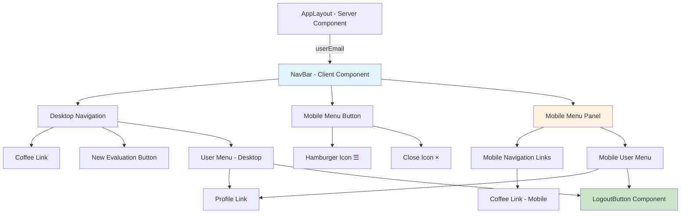

# Design Document: モバイルナビゲーションメニュー

## Overview

モバイルナビゲーションメニュー機能は、スマートフォンやタブレットなどの小画面デバイスでナビゲーション機能を提供するハンバーガーメニューを実装します。この機能は、既存の `NavBar` コンポーネントを拡張し、React の状態管理とTailwind CSSのレスポンシブユーティリティを活用して実装されます。

**主要な技術的決定**:
- Client Componentとして実装（インタラクティブな状態管理が必要）
- useState hookでメニュー開閉状態を管理
- Tailwind CSSの `sm:` ブレークポイント（640px）でデスクトップ/モバイルを切り替え
- アクセシビリティのためaria属性を適切に設定

## Steering Document Alignment

### Technical Standards (tech.md)

**Next.js App Router & React Server Components**:
- `NavBar` コンポーネントは既に Client Component (`'use client'`) として実装されています
- メニュー開閉状態は `useState` で管理し、クライアントサイドのインタラクティブ性を確保します
- 親の `AppLayout` は Server Component として維持し、ユーザー認証情報を props として渡します

**Tailwind CSS レスポンシブデザイン**:
- `sm:` ブレークポイント（640px）を使用してモバイル/デスクトップを切り替えます
- `hidden sm:flex` パターンでデスクトップ表示を制御
- `sm:hidden` パターンでモバイル専用要素を制御

**アクセシビリティ**:
- `aria-expanded` 属性でメニューの開閉状態を通知
- `aria-label` でハンバーガーメニューボタンの目的を説明
- キーボードナビゲーション（Tab, Enter, Escape）をサポート

### Project Structure (structure.md)

**ファイル配置**:
```
app/(app)/_components/
  └── nav-bar.tsx                    # 既存、拡張対象
  └── __tests__/
      └── nav-bar.test.tsx           # 新規作成（TDD）
```

**既存構造との整合性**:
- `app/(app)/layout.tsx` からインポートされる `NavBar` コンポーネントを修正
- テストファイルは `__tests__` ディレクトリに配置（既存のテストパターンに従う）

## Code Reuse Analysis

### Existing Components to Leverage

**NavBar コンポーネント (`app/(app)/_components/nav-bar.tsx`)**:
- **現在の実装**: デスクトップナビゲーションとユーザーメニューを表示
- **再利用方法**: 既存の構造を維持し、モバイルメニュー機能を追加
- **変更箇所**:
  - `useState` でメニュー開閉状態を追加
  - ハンバーガーメニューボタンを追加
  - モバイルメニュー表示領域を追加

**LogoutButton コンポーネント (`components/LogoutButton.tsx`)**:
- **現在の実装**: ログアウト機能を提供、`variant` props で表示スタイルを切り替え可能
- **再利用方法**: モバイルメニュー内で `variant="text"` を指定して表示
- **変更**: 不要（既に実装済み）

### Integration Points

**AppLayout (`app/(app)/layout.tsx`)**:
- **統合方法**: `NavBar` コンポーネントに `userEmail` props を渡す既存の実装を維持
- **変更**: 不要

**Next.js Router (`next/navigation`)**:
- **usePathname hook**: 現在のパスを取得し、アクティブリンクの判定に使用（既存）
- **Link コンポーネント**: ページ遷移に使用（既存）

## Architecture

### Modular Design Principles

**Single File Responsibility**:
- `nav-bar.tsx`: ナビゲーション表示とメニュー開閉状態の管理のみを担当
- テストファイル: コンポーネントの振る舞いのテストのみを担当

**Component Isolation**:
- メニュー開閉状態は `NavBar` コンポーネント内で完結
- 親コンポーネント（AppLayout）への影響なし
- LogoutButton は独立したコンポーネントとして再利用

**State Management**:
- ローカル状態（`useState`）でメニュー開閉を管理
- グローバル状態管理は不要（メニュー状態はコンポーネントローカル）

### Component Architecture



## Components and Interfaces

### NavBar Component (修正)

**File**: `app/(app)/_components/nav-bar.tsx`

**Purpose**: デスクトップとモバイルの両方でナビゲーション機能を提供

**Props Interface**:
```typescript
type NavBarProps = {
  userEmail?: string | null
}
```

**State**:
```typescript
const [isMobileMenuOpen, setIsMobileMenuOpen] = useState(false)
```

**Public Interface**:
- デスクトップナビゲーション（640px以上）
- モバイルハンバーガーメニュー（640px未満）
- メニュー開閉機能

**Dependencies**:
- React: `useState` hook
- Next.js: `Link`, `usePathname`
- `@/components/LogoutButton`

**Reuses**:
- 既存の `navItems` 配列
- 既存の `LogoutButton` コンポーネント
- 既存のスタイルパターン（Tailwind CSS）

### Mobile Menu Button (新規)

**Purpose**: モバイル画面でメニューを開閉するボタン

**Props**: なし（親の `NavBar` から状態とハンドラーを受け取る）

**Structure**:
```tsx
<button
  type="button"
  onClick={() => setIsMobileMenuOpen(!isMobileMenuOpen)}
  className="sm:hidden ..."
  aria-expanded={isMobileMenuOpen}
  aria-label="メニュー"
>
  {isMobileMenuOpen ? <CloseIcon /> : <HamburgerIcon />}
</button>
```

**Icon Implementation**:
- SVG アイコンを直接埋め込み（外部依存なし）
- ハンバーガー: 3本線（path要素で描画）
- クローズ: X印（path要素で描画）

### Mobile Menu Panel (新規)

**Purpose**: モバイル画面でナビゲーションリンクとユーザーメニューを表示

**Conditional Rendering**:
```tsx
{isMobileMenuOpen && (
  <div className="sm:hidden mt-4 space-y-2 border-t border-gray-200 pt-4">
    {/* Navigation Links */}
    {/* User Menu */}
  </div>
)}
```

**Structure**:
- ナビゲーションリンクセクション
- ユーザーメニューセクション（ログイン時のみ）

## Data Models

### Menu State

```typescript
type MenuState = boolean

// Usage
const [isMobileMenuOpen, setIsMobileMenuOpen] = useState<MenuState>(false)
```

**State Transitions**:
- Initial: `false` (メニュー閉じ状態)
- User clicks hamburger button: `false` → `true`
- User clicks close button: `true` → `false`
- User clicks navigation link: `true` → `false`

### NavItem Model (既存)

```typescript
type NavItem = {
  href: string
  label: string
}

const navItems: NavItem[] = [
  { href: '/coffee', label: 'Coffee' },
]
```

## Error Handling

### Error Scenarios

1. **JavaScript無効環境**
   - **Handling**: Progressive Enhancement - デスクトップナビゲーションは引き続き表示
   - **User Impact**: モバイルユーザーはハンバーガーメニューを使用できないが、デスクトップ表示にフォールバック

2. **認証エラー（userEmailがnull）**
   - **Handling**: ユーザーメニューを非表示にする
   - **User Impact**: プロフィールとログアウトオプションが表示されない

3. **レンダリングエラー**
   - **Handling**: React Error Boundary（上位コンポーネントで処理）
   - **User Impact**: エラーページが表示される

## Testing Strategy

### Unit Testing (TDD Approach)

**Test File**: `app/(app)/_components/__tests__/nav-bar.test.tsx`

**Testing Library Stack**:
- Jest: テストランナー
- React Testing Library: コンポーネントレンダリング
- @testing-library/user-event: ユーザーインタラクション
- @testing-library/jest-dom: カスタムマッチャー

**Mock Strategy**:
```typescript
// next/navigation
jest.mock('next/navigation', () => ({
  usePathname: jest.fn(() => '/'),
}))

// LogoutButton
jest.mock('@/components/LogoutButton', () => ({
  LogoutButton: ({ variant }: any) => (
    <button data-testid="logout-button" data-variant={variant}>
      ログアウト
    </button>
  ),
}))

// Viewport size simulation
Object.defineProperty(window, 'matchMedia', {
  writable: true,
  value: jest.fn().mockImplementation(query => ({
    matches: query === '(min-width: 640px)', // デスクトップ
    media: query,
    addEventListener: jest.fn(),
    removeEventListener: jest.fn(),
  })),
})
```

**Test Structure (Red-Green-Refactor)**:

**Phase 1: ハンバーガーメニューボタンの表示**
```typescript
describe('NavBar - Hamburger Menu Button', () => {
  it('should display hamburger button on small screens', () => {})
  it('should hide hamburger button on large screens', () => {})
  it('should show hamburger icon when menu is closed', () => {})
  it('should show close icon when menu is open', () => {})
  it('should display focus state on button focus', () => {})
})
```

**Phase 2: メニューの開閉機能**
```typescript
describe('NavBar - Menu Toggle', () => {
  it('should toggle menu on hamburger button click', () => {})
  it('should display navigation links and user menu when open', () => {})
  it('should close menu after clicking navigation link', () => {})
  it('should update aria-expanded based on menu state', () => {})
})
```

**Phase 3: ナビゲーションリンクの表示**
```typescript
describe('NavBar - Navigation Links', () => {
  it('should display Coffee link when menu is open', () => {})
  it('should apply active style when on /coffee page', () => {})
  it('should apply hover style on link focus', () => {})
  it('should navigate and close menu on link click', () => {})
})
```

**Phase 4: ユーザーメニューの表示**
```typescript
describe('NavBar - User Menu', () => {
  it('should display user menu when user is logged in', () => {})
  it('should hide user menu when user is not logged in', () => {})
  it('should display visual separator between nav and user menu', () => {})
  it('should navigate to /profile and close menu on profile click', () => {})
  it('should trigger logout on logout button click', () => {})
})
```

### Integration Testing

**Integration Test Scenarios**:
1. **Full User Flow**: メニュー開く → リンククリック → ページ遷移 → メニュー閉じる
2. **Responsive Behavior**: ビューポートサイズ変更時の表示切り替え
3. **Authentication State**: ログイン/ログアウト状態でのメニュー表示変化

### End-to-End Testing

**E2E Test Scenarios** (将来的な実装):
1. モバイルデバイスエミュレーションでのナビゲーション
2. タッチイベントによるメニュー操作
3. キーボードナビゲーション（Tab, Enter, Escape）

## Implementation Steps (TDD)

### Phase 1: ハンバーガーメニューボタン

1. **Red**: ハンバーガーボタン表示テストを書く（失敗）
2. **Green**: `<button className="sm:hidden">` を追加（テストパス）
3. **Refactor**: アイコンSVGを整理、アクセシビリティ属性を追加

### Phase 2: メニュー開閉機能

1. **Red**: メニュー開閉テストを書く（失敗）
2. **Green**: `useState` を追加、onClick ハンドラーを実装（テストパス）
3. **Refactor**: イベントハンドラーを useCallback で最適化

### Phase 3: ナビゲーションリンク

1. **Red**: モバイルメニュー内リンク表示テストを書く（失敗）
2. **Green**: モバイルメニューパネルを追加、リンクを表示（テストパス）
3. **Refactor**: デスクトップとモバイルで共通のリンク生成ロジックを抽出

### Phase 4: ユーザーメニュー

1. **Red**: ユーザーメニュー表示テストを書く（失敗）
2. **Green**: モバイルメニュー内にユーザーメニューを追加（テストパス）
3. **Refactor**: スタイルを統一、重複コードを削減

## Performance Considerations

**Rendering Optimization**:
- メニュー開閉時のre-renderは `NavBar` コンポーネント内に限定
- `navItems` は定数として定義（不要な再生成を避ける）
- イベントハンドラーは useCallback で最適化

**Animation Performance**:
- CSS transitions を使用（JavaScript アニメーションより高速）
- `transform` と `opacity` のみをアニメーション（GPU アクセラレーション）
- `will-change` プロパティは使用しない（オーバーヘッドを避ける）

**Bundle Size**:
- アイコンはSVGを直接埋め込み（外部ライブラリ不要）
- 新規依存関係なし（既存のReact/Next.js/Tailwind CSSのみ）

## Accessibility Compliance

**WCAG 2.1 Level AA 準拠**:
- **Perceivable**: 視覚的なフォーカス状態、aria-expanded で状態通知
- **Operable**: キーボード操作可能、タッチターゲット44x44px以上
- **Understandable**: aria-label でボタンの目的を明示
- **Robust**: セマンティックHTMLを使用（button, nav, a）

**Screen Reader Support**:
- `aria-expanded`: メニューの開閉状態
- `aria-label`: ボタンの目的（「メニュー」）
- `aria-current="page"`: 現在のページリンク

**Keyboard Navigation**:
- Tab: フォーカス移動
- Enter/Space: ボタンクリック
- Escape: メニューを閉じる（Phase 4でオプション実装）
