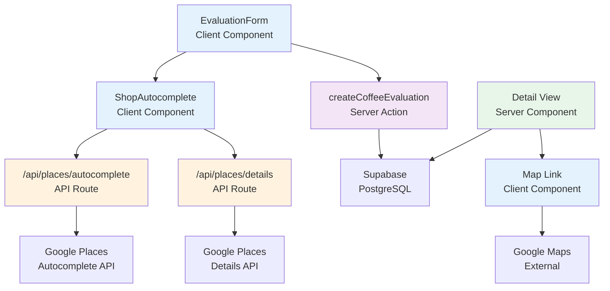

# Design Document

## Overview

Google Places統合機能は、Next.js 15 App Router、Supabase、Google Places API（New）を使用して実装します。この設計では、既存のServer Components優先アーキテクチャを維持しつつ、新しいAPI Routes（Google Places呼び出し用）と再利用可能なオートコンプリートコンポーネントを追加します。

**主要な設計決定**：
- **API Routes**: Google Places APIキーをサーバー側で保護するため、Next.js API Routesを使用
- **Client Component**: オートコンプリートUIは`'use client'`として実装（ユーザー入力とリアルタイム候補表示のため）
- **データベース拡張**: 既存の`coffee_evaluations`テーブルに新しい列を追加（後方互換性を保つ）
- **段階的エンハンスメント**: 既存の手動入力フローを保持し、オートコンプリートは追加機能として実装

## Steering Document Alignment

### Technical Standards (tech.md)

この設計は、tech.mdで定義された技術スタックと原則に従います：

1. **Next.js 15 App Router**:
   - Server Components優先（データフェッチング）
   - Client Components最小化（インタラクティブUIのみ）
   - API Routes（新規）: Google Places API呼び出し専用

2. **TypeScript strict mode**:
   - すべての新しいコンポーネント、API Route、型定義で型安全性を確保
   - Google Places APIレスポンスの型定義を作成

3. **Supabase PostgreSQL**:
   - マイグレーションベースのスキーマ変更
   - 既存データとの後方互換性
   - Row Level Security（RLS）ポリシーの維持

4. **セキュリティ**:
   - APIキーは環境変数（`.env.local`）で管理
   - サーバー側でのみGoogle Places APIを呼び出し
   - クライアントへのAPIキー露出を防止

### Project Structure (structure.md)

この実装は、structure.mdで定義された組織規約に従います：

1. **API Routes**（新規作成）:
   ```
   app/api/
   └── places/
       ├── autocomplete/
       │   └── route.ts          # Autocomplete API
       └── details/
           └── route.ts          # Place Details API
   ```

2. **コンポーネント**:
   ```
   app/(app)/coffee/
   └── _components/
       └── shop-autocomplete/    # Feature-specific component
           ├── ShopAutocomplete.tsx
           └── __tests__/
               └── ShopAutocomplete.test.tsx

   components/ui/               # 既存の共有UIを再利用
   ├── Input.tsx               # ベースとして使用
   └── Button.tsx              # 候補リストで使用
   ```

3. **型定義**:
   ```
   lib/types/
   ├── database.types.ts       # 既存（Supabaseで再生成）
   └── google-places.ts        # 新規: Google Places型定義
   ```

4. **データベースマイグレーション**:
   ```
   supabase/migrations/
   └── [timestamp]_add_google_places_fields.sql
   ```

## Code Reuse Analysis

### Existing Components to Leverage

- **`components/ui/Input.tsx`**:
  - オートコンプリートの入力フィールドのベースとして使用
  - 既存のスタイルと動作を継承

- **`components/ui/Button.tsx`**:
  - 候補リストのアイテムクリック時の視覚的フィードバック（オプション）

- **`app/(app)/coffee/_components/evaluation-form.tsx`**:
  - 既存のフォームコンポーネント
  - `shopName`入力を`ShopAutocomplete`コンポーネントに置き換え
  - フォームデータ処理ロジックを拡張（地図URLフィールドを追加）

### Existing Services to Extend

- **`lib/actions/coffee.ts`**:
  - `createCoffeeEvaluation`: 新しいフィールド（google_place_id, shop_address, shop_map_url）を処理するよう拡張
  - `updateCoffeeEvaluation`: 同様に拡張
  - `parseEvaluationFormData`: 新しいフィールドのパースロジックを追加

- **`lib/supabase/server.ts`**:
  - 既存のSupabaseクライアント作成ロジックを再利用
  - データベースクエリで新しい列を参照

### Integration Points

- **既存のフォームフロー**:
  - `EvaluationForm`コンポーネントに`ShopAutocomplete`を統合
  - 既存の`shopName`ステート管理を拡張して、place_id、住所、地図URLも保存

- **データベース**:
  - `coffee_evaluations`テーブルに新しい列を追加
  - 既存のクエリ、インデックス、RLSポリシーを保持
  - 新しい列はNULL許可（既存データとの互換性）

- **型システム**:
  - `database.types.ts`を再生成（Supabase CLI）
  - 新しいGoogle Places型定義を追加

## Architecture

### Overall Architecture Pattern



### Modular Design Principles

1. **Single File Responsibility**:
   - `app/api/places/autocomplete/route.ts`: Autocomplete API専用
   - `app/api/places/details/route.ts`: Place Details API専用
   - `ShopAutocomplete.tsx`: オートコンプリートUI専用

2. **Component Isolation**:
   - `ShopAutocomplete`は独立したコンポーネント（他のフォームでも再利用可能）
   - propsとして`onSelect`コールバックを受け取り、親コンポーネントとの結合度を低減

3. **Service Layer Separation**:
   - **Presentation**: `ShopAutocomplete` (Client Component)
   - **API Layer**: `/api/places/*` (Server-side API Routes)
   - **Business Logic**: `lib/actions/coffee.ts` (Server Actions)
   - **Data Access**: Supabase client

4. **Utility Modularity**:
   - Google Places型定義を`lib/types/google-places.ts`に集約
   - 地図URL生成ロジックをユーティリティ関数として分離（`lib/utils/google-maps.ts`）

### Data Flow

**Autocomplete Flow**:
```
User types → ShopAutocomplete (debounce 300ms) →
/api/places/autocomplete → Google Places Autocomplete API →
Suggestions → ShopAutocomplete (display list) →
User selects → /api/places/details → Google Places Details API →
Place data → ShopAutocomplete (onSelect callback) →
EvaluationForm (update state) → Form submission →
createCoffeeEvaluation (Server Action) → Supabase
```

**Map Link Flow**:
```
User views detail → Detail View (Server Component) →
Supabase (fetch evaluation with shop_map_url) →
Render MapLink (Client Component) →
User clicks → Open Google Maps (new tab)
```

## Components and Interfaces

### Component 1: ShopAutocomplete (Client Component)

- **Purpose**: Google Places Autocompleteを使って店舗候補を表示し、ユーザーが選択できるようにする
- **Location**: `app/(app)/coffee/_components/shop-autocomplete/ShopAutocomplete.tsx`
- **Type**: Client Component (`'use client'`)

**Props Interface**:
```typescript
interface ShopAutocompleteProps {
  onSelect: (shopData: ShopData) => void
  initialValue?: string
  placeholder?: string
  disabled?: boolean
}

interface ShopData {
  name: string
  placeId: string
  address: string
  mapUrl: string
  location?: {
    lat: number
    lng: number
  }
}
```

**State**:
```typescript
const [query, setQuery] = useState<string>('')
const [suggestions, setSuggestions] = useState<PlaceSuggestion[]>([])
const [isLoading, setIsLoading] = useState<boolean>(false)
const [error, setError] = useState<string | null>(null)
const [sessionToken, setSessionToken] = useState<string>('')
```

**Key Methods**:
- `handleInputChange(value: string)`: 入力変更時、debounceしてAutocomplete APIを呼び出し
- `handleSelectSuggestion(placeId: string)`: 候補選択時、Details APIを呼び出し、`onSelect`コールバックを実行
- `generateSessionToken()`: Autocompleteセッショントークンを生成（コスト最適化）

**Dependencies**:
- `fetch` (API呼び出し)
- `useState`, `useEffect`, `useCallback` (React hooks)
- カスタムhook: `useDebounce` (入力のdebounce処理)

**Reuses**:
- `Input` コンポーネントのスタイルとアクセシビリティ属性

---

### Component 2: MapLink (Client Component)

- **Purpose**: 詳細画面で地図リンクを表示し、クリック時にGoogle Mapsを新しいタブで開く
- **Location**: `app/(app)/coffee/_components/shared/MapLink.tsx`
- **Type**: Client Component (`'use client'`)

**Props Interface**:
```typescript
interface MapLinkProps {
  mapUrl: string
  shopName: string
  className?: string
}
```

**Behavior**:
- 地図アイコン（📍またはSVG）とテキスト「地図で見る」を表示
- クリック時: `window.open(mapUrl, '_blank', 'noopener,noreferrer')`
- `aria-label`: `{shopName}の場所を地図で確認`

**Dependencies**: なし（純粋なプレゼンテーションコンポーネント）

**Reuses**: Tailwind CSSスタイル、既存のアイコンパターン

---

### Component 3: API Route - `/api/places/autocomplete`

- **Purpose**: Google Places Autocomplete APIを呼び出し、店舗候補を返す
- **Location**: `app/api/places/autocomplete/route.ts`
- **Type**: Next.js API Route (Server-side)

**Request**:
```typescript
GET /api/places/autocomplete?input=<query>&sessionToken=<token>
```

**Query Parameters**:
- `input` (string, required): 検索クエリ（ユーザー入力）
- `sessionToken` (string, optional): セッショントークン（コスト最適化）

**Response**:
```typescript
{
  predictions: Array<{
    placeId: string
    description: string  // "スターバックス コーヒー 渋谷店, 東京都..."
    mainText: string     // "スターバックス コーヒー 渋谷店"
    secondaryText: string // "東京都..."
  }>
}
```

**Error Response**:
```typescript
{
  error: string  // "候補を取得できませんでした"
}
```

**Implementation**:
```typescript
export async function GET(request: NextRequest) {
  const input = request.nextUrl.searchParams.get('input')
  const sessionToken = request.nextUrl.searchParams.get('sessionToken')

  // Validation
  if (!input || input.length < 2) {
    return NextResponse.json({ predictions: [] })
  }

  // Call Google Places Autocomplete API (New)
  const response = await fetch(
    'https://places.googleapis.com/v1/places:autocomplete',
    {
      method: 'POST',
      headers: {
        'Content-Type': 'application/json',
        'X-Goog-Api-Key': process.env.GOOGLE_PLACES_API_KEY!,
      },
      body: JSON.stringify({
        input,
        languageCode: 'ja',
        includedPrimaryTypes: ['cafe', 'restaurant'],
        sessionToken,
      }),
    }
  )

  const data = await response.json()

  // Transform to simplified format
  const predictions = data.suggestions?.map(s => ({
    placeId: s.placePrediction.placeId,
    description: s.placePrediction.text.text,
    mainText: s.placePrediction.structuredFormat.mainText.text,
    secondaryText: s.placePrediction.structuredFormat.secondaryText.text,
  })) || []

  return NextResponse.json({ predictions })
}
```

**Dependencies**:
- `process.env.GOOGLE_PLACES_API_KEY`
- `NextRequest`, `NextResponse` from `next/server`

**Error Handling**:
- API呼び出し失敗時: エラーをログに記録し、空の配列を返す
- 入力検証失敗: 空の配列を返す（エラーではなく正常応答）

---

### Component 4: API Route - `/api/places/details`

- **Purpose**: Google Places Details APIを呼び出し、選択された店舗の詳細情報を返す
- **Location**: `app/api/places/details/route.ts`
- **Type**: Next.js API Route (Server-side)

**Request**:
```typescript
GET /api/places/details?placeId=<place_id>
```

**Query Parameters**:
- `placeId` (string, required): Google Place ID

**Response**:
```typescript
{
  name: string           // "スターバックス コーヒー 渋谷店"
  placeId: string        // "ChIJ..."
  address: string        // "東京都渋谷区..."
  mapUrl: string         // "https://www.google.com/maps/place/?q=place_id:ChIJ..."
  location: {
    lat: number          // 35.6585
    lng: number          // 139.7454
  }
}
```

**Implementation**:
```typescript
export async function GET(request: NextRequest) {
  const placeId = request.nextUrl.searchParams.get('placeId')

  if (!placeId) {
    return NextResponse.json(
      { error: 'Place IDが必要です' },
      { status: 400 }
    )
  }

  // Call Google Places Details API (New)
  const response = await fetch(
    `https://places.googleapis.com/v1/places/${placeId}`,
    {
      headers: {
        'X-Goog-Api-Key': process.env.GOOGLE_PLACES_API_KEY!,
        'X-Goog-FieldMask': 'id,displayName,formattedAddress,location',
      },
    }
  )

  const data = await response.json()

  // Generate Google Maps URL
  const mapUrl = `https://www.google.com/maps/place/?q=place_id:${placeId}`

  return NextResponse.json({
    name: data.displayName.text,
    placeId: data.id,
    address: data.formattedAddress,
    mapUrl,
    location: {
      lat: data.location.latitude,
      lng: data.location.longitude,
    },
  })
}
```

**Dependencies**:
- `process.env.GOOGLE_PLACES_API_KEY`
- `generateMapUrl` utility function

**Error Handling**:
- Place ID検証失敗: 400エラー
- API呼び出し失敗: 500エラー、ログ記録

---

### Component 5: Enhanced EvaluationForm

- **Purpose**: 既存の評価フォームに`ShopAutocomplete`を統合
- **Location**: `app/(app)/coffee/_components/evaluation-form.tsx`
- **Type**: Client Component (既存)

**Changes**:
```typescript
// 新しいステート
const [shopPlaceId, setShopPlaceId] = useState(initialData?.google_place_id ?? '')
const [shopAddress, setShopAddress] = useState(initialData?.shop_address ?? '')
const [shopMapUrl, setShopMapUrl] = useState(initialData?.shop_map_url ?? '')

// ShopAutocompleteのonSelectハンドラー
const handleShopSelect = (shopData: ShopData) => {
  setShopName(shopData.name)
  setShopPlaceId(shopData.placeId)
  setShopAddress(shopData.address)
  setShopMapUrl(shopData.mapUrl)
}

// FormDataに新しいフィールドを追加
const buildFormData = () => {
  const formData = new FormData()
  // ... 既存のフィールド
  formData.set('shop_name', shopName)
  formData.set('google_place_id', shopPlaceId)
  formData.set('shop_address', shopAddress)
  formData.set('shop_map_url', shopMapUrl)
  return formData
}
```

**JSX Changes**:
```tsx
{/* 既存のInput を ShopAutocomplete に置き換え */}
<ShopAutocomplete
  onSelect={handleShopSelect}
  initialValue={shopName}
  placeholder="店名を入力..."
/>

{/* 地図URLプレビュー（編集時） */}
{shopMapUrl && (
  <div className="text-sm text-neutral-600">
    📍 {shopAddress}
    <MapLink mapUrl={shopMapUrl} shopName={shopName} />
  </div>
)}
```

---

### Component 6: Enhanced Coffee Detail View

- **Purpose**: 詳細画面に地図リンクを表示
- **Location**: `app/(app)/coffee/[id]/_components/evaluation/view.tsx`
- **Type**: Server Component (既存)

**Changes**:
```tsx
// 店名の横に地図リンクを追加
<div className="flex items-center gap-2">
  <h2 className="text-xl font-semibold">{evaluation.shop_name}</h2>
  {evaluation.shop_map_url && (
    <MapLink
      mapUrl={evaluation.shop_map_url}
      shopName={evaluation.shop_name}
    />
  )}
</div>

{/* 住所を表示（オプション） */}
{evaluation.shop_address && (
  <p className="text-sm text-neutral-600">📍 {evaluation.shop_address}</p>
)}
```

## Data Models

### Enhanced coffee_evaluations Table

新しい列を追加（すべてNULL許可で後方互換性を保つ）:

```sql
-- Google Places統合フィールド
google_place_id TEXT,              -- Google Place ID (例: "ChIJ...")
shop_address TEXT,                 -- 店舗住所 (例: "東京都渋谷区...")
shop_map_url TEXT,                 -- Google Maps URL
shop_location POINT,               -- 緯度経度 (将来的な距離検索用)

-- インデックス
CREATE INDEX idx_coffee_evaluations_google_place_id
  ON coffee_evaluations(google_place_id)
  WHERE google_place_id IS NOT NULL;

-- 既存の列はそのまま維持
shop_name TEXT NOT NULL,           -- 既存（手動入力も引き続き可能）
```

**Row Example** (Google Placesから選択):
```typescript
{
  id: "uuid...",
  user_id: "uuid...",
  shop_name: "スターバックス コーヒー 渋谷店",
  google_place_id: "ChIJ...",
  shop_address: "東京都渋谷区道玄坂1-5-8",
  shop_map_url: "https://www.google.com/maps/place/?q=place_id:ChIJ...",
  shop_location: "POINT(139.6980 35.6580)",  // PostGIS POINT型
  bean_name: "ブレンド No.3",
  // ... その他のフィールド
}
```

**Row Example** (手動入力):
```typescript
{
  id: "uuid...",
  user_id: "uuid...",
  shop_name: "近所のカフェ",
  google_place_id: null,           // 手動入力時はNULL
  shop_address: null,
  shop_map_url: null,
  shop_location: null,
  bean_name: "ブレンド",
  // ... その他のフィールド
}
```

### Google Places Type Definitions

`lib/types/google-places.ts`:

```typescript
// Autocomplete APIレスポンス
export interface PlaceSuggestion {
  placeId: string
  description: string
  mainText: string
  secondaryText: string
}

export interface AutocompleteResponse {
  predictions: PlaceSuggestion[]
}

// Place Details APIレスポンス
export interface PlaceDetails {
  name: string
  placeId: string
  address: string
  mapUrl: string
  location?: {
    lat: number
    lng: number
  }
}

// ShopAutocomplete コンポーネント用
export interface ShopData {
  name: string
  placeId: string
  address: string
  mapUrl: string
  location?: {
    lat: number
    lng: number
  }
}
```

### Updated ParsedEvaluationData Interface

`lib/actions/coffee.ts`:

```typescript
interface ParsedEvaluationData {
  shop_name: string
  google_place_id?: string | null      // 新規
  shop_address?: string | null         // 新規
  shop_map_url?: string | null         // 新規
  shop_location?: string | null        // 新規 (PostGIS POINT形式)
  bean_type: string
  bean_name: string | null
  roast_level: string | null
  acidity: number
  bitterness: number
  aroma: number
  overall_rating: number
  is_public: boolean
}
```

## Error Handling

### Error Scenarios

1. **Google Places API呼び出し失敗**:
   - **Handling**:
     - エラーをサーバーログに記録（`console.error`）
     - クライアントには空の候補リスト（`{ predictions: [] }`）を返す
     - `ShopAutocomplete`はエラーメッセージを表示: "候補を取得できませんでした。手動で入力してください。"
   - **User Impact**:
     - オートコンプリートは動作しないが、手動入力は可能
     - ユーザーは評価を継続できる

2. **無効なPlace ID**:
   - **Handling**:
     - Details API呼び出し前にPlace ID形式を検証（正規表現: `/^ChIJ[a-zA-Z0-9_-]+$/`）
     - 無効な場合、400エラーを返す
   - **User Impact**:
     - "店舗情報を取得できませんでした"とエラーメッセージ
     - ユーザーは候補リストから再選択

3. **APIキー未設定**:
   - **Handling**:
     - サーバー起動時、環境変数`GOOGLE_PLACES_API_KEY`の存在を確認
     - 未設定の場合、起動エラー（開発環境のみ）
     - 本番環境では、API呼び出し時に500エラー
   - **User Impact**:
     - オートコンプリート機能が完全に動作しない
     - 手動入力にフォールバック

4. **ネットワークタイムアウト**:
   - **Handling**:
     - API呼び出しに5秒のタイムアウトを設定
     - タイムアウト時、エラーを記録し空のレスポンスを返す
   - **User Impact**:
     - "候補を取得中にタイムアウトしました"とメッセージ
     - 手動入力可能

5. **レート制限超過**:
   - **Handling**:
     - Google Places APIのレート制限エラー（429）を検出
     - クライアントに適切なエラーメッセージを返す
   - **User Impact**:
     - "現在、店舗候補を表示できません。しばらく経ってから再度お試しください。"
     - 手動入力は継続可能

6. **データベースマイグレーション失敗**:
   - **Handling**:
     - マイグレーション実行前にバックアップ推奨（ローカル開発）
     - エラー時、ロールバック可能
   - **User Impact**:
     - 開発者向け（ユーザーには影響なし）

## Testing Strategy

### Unit Testing

**ShopAutocompleteコンポーネント**:
```typescript
// app/(app)/coffee/_components/shop-autocomplete/__tests__/ShopAutocomplete.test.tsx

describe('ShopAutocomplete', () => {
  it('renders input field with placeholder', () => {
    render(<ShopAutocomplete onSelect={jest.fn()} placeholder="店名を入力" />)
    expect(screen.getByPlaceholderText('店名を入力')).toBeInTheDocument()
  })

  it('debounces input and calls autocomplete API', async () => {
    // Mock fetch
    global.fetch = jest.fn(() =>
      Promise.resolve({
        json: () => Promise.resolve({ predictions: mockPredictions }),
      })
    )

    const { user } = render(<ShopAutocomplete onSelect={jest.fn()} />)
    const input = screen.getByRole('textbox')

    // Type "スタバ"
    await user.type(input, 'スタバ')

    // Wait for debounce (300ms)
    await waitFor(() => {
      expect(fetch).toHaveBeenCalledWith(
        expect.stringContaining('/api/places/autocomplete?input=スタバ')
      )
    }, { timeout: 500 })
  })

  it('displays suggestions when API returns results', async () => {
    // ... テストロジック
  })

  it('calls onSelect with shop data when suggestion is clicked', async () => {
    const onSelect = jest.fn()
    // ... テストロジック
    expect(onSelect).toHaveBeenCalledWith({
      name: 'スターバックス',
      placeId: 'ChIJ...',
      address: '東京都...',
      mapUrl: 'https://...',
    })
  })

  it('displays error message when API fails', async () => {
    global.fetch = jest.fn(() => Promise.reject(new Error('API error')))
    // ... テストロジック
    expect(screen.getByText(/候補を取得できませんでした/)).toBeInTheDocument()
  })
})
```

**API Routes**:
```typescript
// app/api/places/autocomplete/__tests__/route.test.ts

describe('GET /api/places/autocomplete', () => {
  it('returns predictions for valid input', async () => {
    const request = new NextRequest(
      'http://localhost:3000/api/places/autocomplete?input=スタバ'
    )
    const response = await GET(request)
    const data = await response.json()

    expect(data.predictions).toBeInstanceOf(Array)
  })

  it('returns empty array for input < 2 characters', async () => {
    const request = new NextRequest(
      'http://localhost:3000/api/places/autocomplete?input=ス'
    )
    const response = await GET(request)
    const data = await response.json()

    expect(data.predictions).toEqual([])
  })

  it('handles API errors gracefully', async () => {
    // Mock Google Places API error
    // ... テストロジック
  })
})
```

**Server Actions**:
```typescript
// lib/actions/__tests__/coffee.test.ts

describe('createCoffeeEvaluation with Google Places data', () => {
  it('saves evaluation with Google Places fields', async () => {
    const formData = new FormData()
    formData.set('shop_name', 'スターバックス')
    formData.set('google_place_id', 'ChIJ...')
    formData.set('shop_address', '東京都...')
    formData.set('shop_map_url', 'https://...')
    // ... その他のフィールド

    await createCoffeeEvaluation(formData)

    // Verify database insert
    const { data } = await supabase
      .from('coffee_evaluations')
      .select('*')
      .eq('shop_name', 'スターバックス')
      .single()

    expect(data.google_place_id).toBe('ChIJ...')
    expect(data.shop_address).toBe('東京都...')
  })

  it('saves evaluation without Google Places data (manual input)', async () => {
    const formData = new FormData()
    formData.set('shop_name', '近所のカフェ')
    // google_place_id, shop_address, shop_map_url は未設定

    await createCoffeeEvaluation(formData)

    const { data } = await supabase
      .from('coffee_evaluations')
      .select('*')
      .eq('shop_name', '近所のカフェ')
      .single()

    expect(data.google_place_id).toBeNull()
    expect(data.shop_address).toBeNull()
  })
})
```

### Integration Testing

**評価作成フロー（オートコンプリート使用）**:
```typescript
// app/(app)/coffee/__tests__/create-with-autocomplete.test.tsx

describe('Create coffee evaluation with autocomplete', () => {
  it('allows user to search, select shop, and submit evaluation', async () => {
    const { user } = render(<CoffeeNewPage />)

    // 1. 店名入力フィールドに入力
    const shopInput = screen.getByPlaceholderText(/店名/)
    await user.type(shopInput, 'スタバ')

    // 2. 候補リストが表示される
    await waitFor(() => {
      expect(screen.getByText(/スターバックス コーヒー 渋谷店/)).toBeInTheDocument()
    })

    // 3. 候補を選択
    await user.click(screen.getByText(/スターバックス コーヒー 渋谷店/))

    // 4. フォームに店舗情報が自動入力される
    expect(shopInput).toHaveValue('スターバックス コーヒー 渋谷店')
    expect(screen.getByText(/東京都渋谷区/)).toBeInTheDocument()

    // 5. その他のフィールドを入力
    await user.type(screen.getByLabelText(/豆の名前/), 'ブレンド')
    // ... 評価スライダーを操作

    // 6. フォーム送信
    await user.click(screen.getByRole('button', { name: /保存/ }))

    // 7. 詳細ページにリダイレクト
    await waitFor(() => {
      expect(window.location.pathname).toMatch(/\/coffee\/[a-z0-9-]+/)
    })

    // 8. 地図リンクが表示される
    expect(screen.getByLabelText(/地図で確認/)).toBeInTheDocument()
  })
})
```

**評価編集フロー**:
- 既存の評価（Google Places情報あり）を編集
- 店名を変更（新しい候補を選択）
- 地図URLが更新されることを確認

**手動入力フロー**:
- オートコンプリートを使わず、直接店名を入力
- 評価を作成
- 地図リンクが表示されないことを確認

### End-to-End Testing

**主要ユーザーシナリオ**:

1. **新規ユーザーが初めて評価を記録**:
   - ログイン
   - 「新規作成」ボタンをクリック
   - 店名入力時、オートコンプリート候補が表示される
   - 候補から選択
   - 評価を入力して保存
   - 詳細画面で地図リンクをクリック → Google Mapsが開く

2. **既存ユーザーが過去の評価を編集**:
   - 評価一覧から編集ボタンをクリック
   - 店名を変更（新しい候補を選択）
   - 保存
   - 詳細画面で新しい地図リンクを確認

3. **オートコンプリート失敗時のフォールバック**:
   - ネットワークをオフラインに設定（開発ツール）
   - 店名入力
   - エラーメッセージが表示される
   - 手動で店名を入力
   - 評価を正常に保存できる

## Implementation Notes

### Environment Variables

`.env.local` (Gitにコミットしない):
```env
# Google Places API Key (取得: Google Cloud Console)
GOOGLE_PLACES_API_KEY=AIza...your_api_key_here
```

`.env.example` (テンプレート):
```env
# Google Places API Key
# Get your key from: https://console.cloud.google.com/apis/credentials
GOOGLE_PLACES_API_KEY=
```

### Google Cloud Console Setup

1. **プロジェクト作成** または既存プロジェクトを選択
2. **Places API (New)** を有効化
3. **認証情報** → **APIキーを作成**
4. **キーの制限**:
   - **アプリケーションの制限**: HTTPリファラー
     - 開発: `http://localhost:3000/*`
     - 本番: `https://yourdomain.com/*`
   - **API の制限**: Places API (New)のみ許可
5. **クォータ**:
   - 1日あたりのリクエスト上限: 500（無料枠内）
   - 必要に応じて調整

### Cost Optimization Strategies

1. **Session Tokens**:
   - オートコンプリートの複数リクエストを1セッションとしてカウント
   - コスト削減: $2.83/1000セッション（リクエストごとではなく）

2. **Field Masks**:
   - Place Details APIで必要なフィールドのみをリクエスト
   - 例: `X-Goog-FieldMask: id,displayName,formattedAddress,location`
   - 不要なフィールド（営業時間、写真など）を除外

3. **Caching** (オプション):
   - クライアント側: 同じクエリの結果を5分間キャッシュ
   - サーバー側: Place Detailsの結果をRedis/Supabaseで24時間キャッシュ（将来的な拡張）

4. **Debounce**:
   - ユーザー入力を300msデバウンスし、API呼び出し回数を削減

### Migration Strategy

**段階的なロールアウト**:

1. **Phase 1** (このspec):
   - データベーススキーマ拡張
   - オートコンプリート機能実装
   - 既存データは変更なし（NULL許可）

2. **Phase 2** (将来的):
   - 既存の評価に対して、手動で店舗情報を追加する機能
   - "この評価に店舗情報を追加" ボタン

3. **Phase 3** (将来的):
   - 同じ店舗の評価を集約表示
   - 店舗別の統計・インサイト
