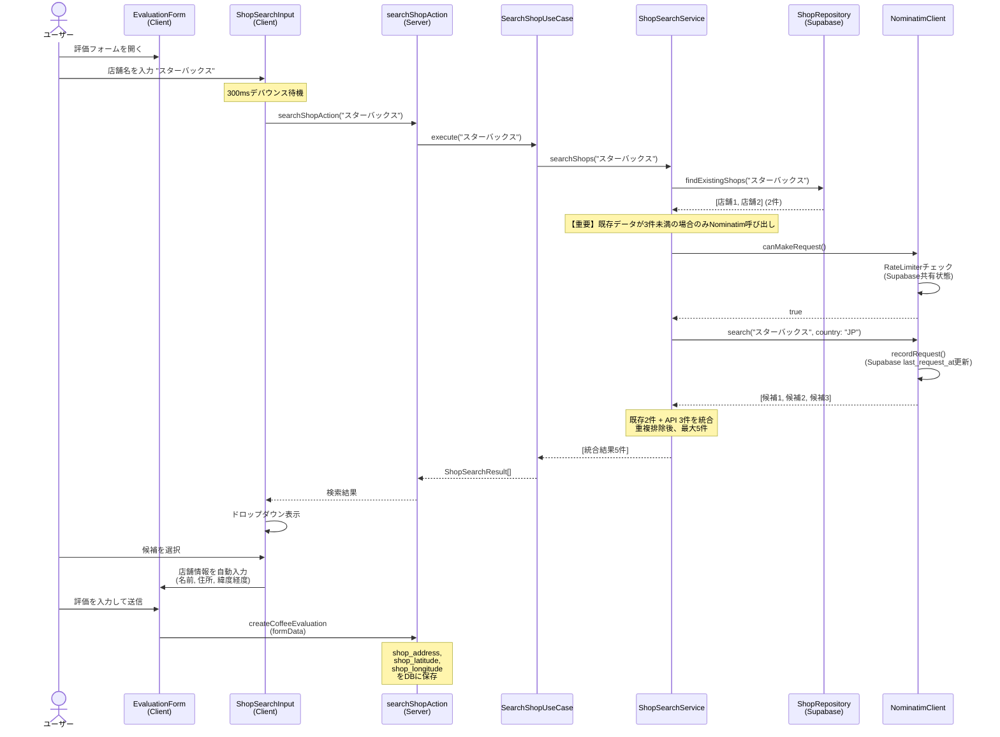
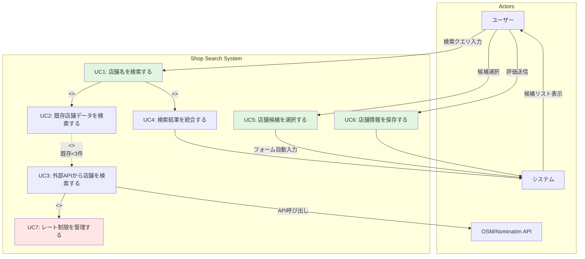
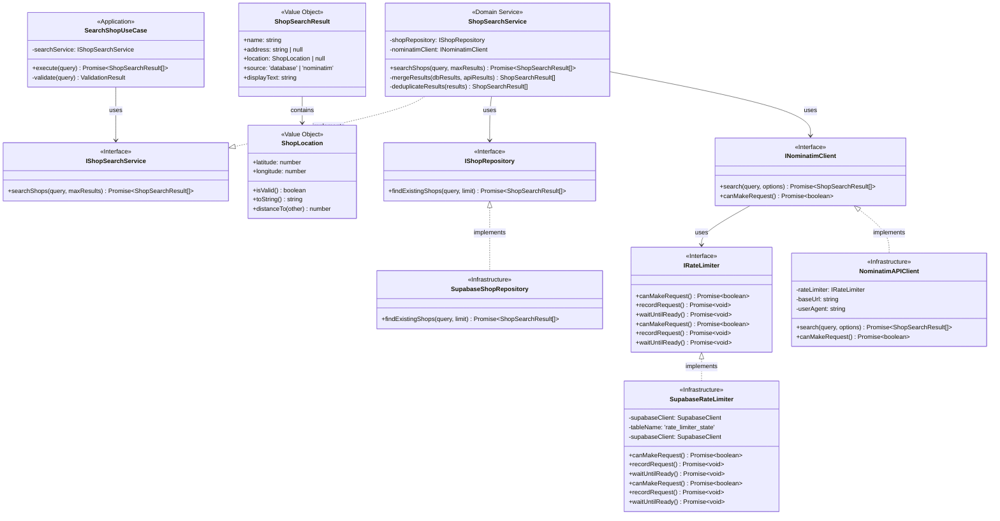
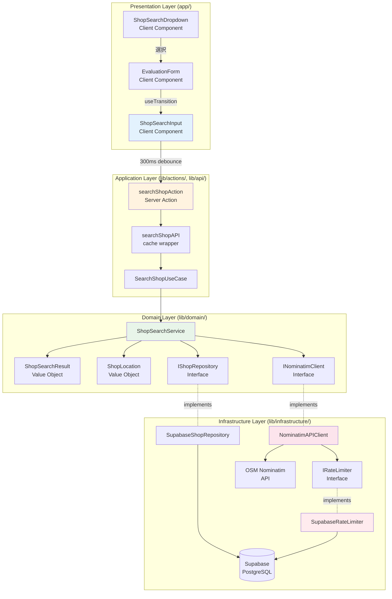
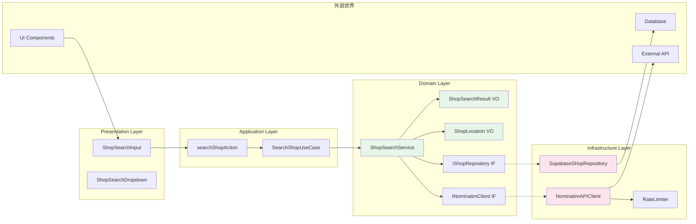

# Design Document: Shop Search Integration

## Overview

店舗検索機能は、コーヒー評価フォームに統合され、ユーザーが店舗名を入力する際に既存データベースとOpenStreetMap Nominatim APIからの候補を表示します。サーバーサイド検索により、Nominatimの利用規約（クライアントサイドオートコンプリート禁止、1req/sec制限）を遵守しながら、シームレスな検索体験を提供します。

**アーキテクチャアプローチ**: Clean Architectureの層を維持し、Domain層にビジネスロジック、Infrastructure層にNominatim API依存、Application層にユースケース、Presentation層にUIを配置します。既存のServer Actions + API layer + cache()パターンを踏襲します。

## Ubiquitous Language（ユビキタス言語）

この機能で導入される新しいドメイン用語と、既存用語の拡張を定義します。すべてのコード、UI、会話、ドキュメントで統一して使用してください。

### 新規ドメイン用語

#### Shop Search Result（店舗検索結果）

| 項目 | 内容 |
|------|------|
| **単語** | 店舗検索結果 |
| **英語（コード）** | ShopSearchResult |
| **よくある間違い** | ✗ 店舗候補、検索候補、SearchResult |
| **プロダクト内文言** | 検索結果、候補 |
| **タグ** | #値オブジェクト #検索 |
| **意味** | 店舗検索で得られた候補。店名、住所、位置情報、検索ソースを含む。 |
| **モデル名** | `ShopSearchResult` (shop-search-result.ts) |
| **関連モデル** | ShopLocation, SearchSource |

**プロパティ**:
- `name`: string - 店舗名（必須）
- `address`: string \| null - 住所（オプション）
- `location`: ShopLocation \| null - 位置情報（オプション）
- `source`: SearchSource - 検索ソース（'database' または 'nominatim'）

**使用例**:
```typescript
// ✓ 正しい
const result = new ShopSearchResult("スターバックス 渋谷店", "東京都渋谷区...", location, "nominatim")
result.displayText  // "スターバックス 渋谷店 - 東京都渋谷区..."

// ✗ 避ける
const candidate = new ShopCandidate(...)  // "Candidate"は使わない
const suggestion = { name: "..." }         // クラスを使う
```

#### Shop Location（店舗位置情報）

| 項目 | 内容 |
|------|------|
| **単語** | 店舗位置情報 |
| **英語（コード）** | ShopLocation / shop_latitude, shop_longitude |
| **よくある間違い** | ✗ 座標、位置、ロケーション、GPS |
| **プロダクト内文言** | 位置情報 |
| **タグ** | #値オブジェクト #地理情報 |
| **意味** | 店舗の地理的位置を表す緯度経度の組。将来の地図表示、距離計算に使用。 |
| **モデル名** | `ShopLocation` (shop-location.ts) |
| **関連モデル** | ShopSearchResult |

**制約**:
- 緯度（latitude）: -90 ~ 90
- 経度（longitude）: -180 ~ 180
- 精度: NUMERIC(10, 7) - 約1.1cm精度

**使用例**:
```typescript
// ✓ 正しい
const location = new ShopLocation(35.6581, 139.7414)  // 東京タワー
if (location.isValid()) { ... }

// ✗ 避ける
const coords = { lat: 35.6581, lng: 139.7414 }  // クラスを使う
const position = [35.6581, 139.7414]            // 配列ではなくクラス
```

#### Shop Address（店舗住所）

| 項目 | 内容 |
|------|------|
| **単語** | 店舗住所 |
| **英語（コード）** | shopAddress / shop_address |
| **よくある間違い** | ✗ アドレス、所在地、場所 |
| **プロダクト内文言** | 住所 |
| **タグ** | #属性 |
| **意味** | 店舗の住所文字列。Nominatim APIまたは手入力で取得。ShopSearchResultの属性として使用。 |
| **データベース** | `shop_address` (TEXT, nullable) |
| **関連モデル** | CoffeeEvaluation, ShopSearchResult |

**制約**:
- 型: TEXT（長さ制限なし）
- NULL許容: はい（位置情報がない場合）
- トリミング: 前後の空白を削除

**使用例**:
```typescript
// ✓ 正しい
shopAddress: "東京都渋谷区道玄坂2-1-1"
shopAddress: null  // 住所不明の場合

// ✗ 避ける
address: "住所: 東京都..."  // プレフィックス不要
location: "東京都..."       // "address"を使う
```

#### Search Source（検索ソース）

| 項目 | 内容 |
|------|------|
| **単語** | 検索ソース |
| **英語（コード）** | SearchSource / source |
| **よくある間違い** | ✗ ソース、元、データソース |
| **プロダクト内文言** | （UI表示なし - 内部用） |
| **タグ** | #列挙型 |
| **意味** | 検索結果の取得元。既存データベースまたはNominatim API。 |
| **型** | `'database' \| 'nominatim'` |

**選択肢**:
- `'database'`: 既存のcoffee_evaluationsから取得した店舗名
- `'nominatim'`: OpenStreetMap Nominatim APIから取得した店舗情報

**使用例**:
```typescript
// ✓ 正しい
source: 'database'
source: 'nominatim'

// ✗ 避ける
source: 'db'         // 短縮形は使わない
source: 'api'        // 具体的に'nominatim'
source: 'local'      // 'database'を使う
```

### 既存用語の拡張

#### Shop Info（店舗情報）- 拡張版

| 項目 | 内容 |
|------|------|
| **単語** | 店舗情報 |
| **英語（コード）** | ShopInfo (拡張) |
| **変更内容** | shop_name のみ → shop_name, shop_address, shop_latitude, shop_longitude |
| **タグ** | #値オブジェクト #拡張 |
| **意味** | コーヒーを購入・飲食した店舗の情報。店名、住所、位置情報を含む。 |

**新規フィールド**:
1. **shop_address** (TEXT, nullable) - 店舗住所
2. **shop_latitude** (NUMERIC(10,7), nullable) - 緯度
3. **shop_longitude** (NUMERIC(10,7), nullable) - 経度

**後方互換性**:
- 既存データ: 新規フィールドはNULL
- 既存コード: shop_nameのみ使用しているコードは影響なし
- 新規コード: 住所・位置情報はオプションとして扱う

**使用例**:
```typescript
// ✓ 正しい（既存コード - 引き続き動作）
const evaluation = { shop_name: "スターバックス" }

// ✓ 正しい（新規コード - 位置情報付き）
const evaluation = {
  shop_name: "スターバックス 渋谷店",
  shop_address: "東京都渋谷区道玄坂2-1-1",
  shop_latitude: 35.6581,
  shop_longitude: 139.7414
}

// ✓ 正しい（住所のみ、位置情報なし）
const evaluation = {
  shop_name: "カフェA",
  shop_address: "東京都新宿区",
  shop_latitude: null,
  shop_longitude: null
}
```

### ドメインルール

1. **検索優先順位**: 既存データベース → Nominatim API（既存3件未満時のみ）
2. **レート制限**: Nominatim APIは1リクエスト/秒を厳守（OSM利用規約）
3. **位置情報の有効性**: 緯度経度は範囲内（-90~90, -180~180）でなければShopLocation生成時にエラー
4. **検索結果の統合**: 既存データとAPI結果を統合し、重複排除後、最大5件まで表示
5. **NULL許容**: 住所・位置情報はオプション。NULLでも評価は作成可能（後方互換性）

### UI文言ガイドライン

| コンテキスト | 文言 |
|-------------|------|
| 検索入力欄 | 「店舗名を入力」「店舗名で検索」 |
| 検索中 | 「検索中...」 |
| 候補表示 | 「検索結果」「候補」 |
| 候補なし | 「候補が見つかりませんでした」「手入力で追加できます」 |
| 住所フィールド | 「住所」 |
| 位置情報 | 「位置情報」（通常は非表示） |

**避けるべき表現**:
- ✗ 「店舗を検索」（目的語が曖昧）
- ✗ 「お店の名前」（カジュアルすぎる）
- ✗ 「ロケーション」（カタカナ英語）
- ✗ 「GPS情報」（技術用語）

### コード内の用語統一チェックリスト

実装時は以下を確認してください：

- [ ] Value Object名: `ShopSearchResult`, `ShopLocation`（大文字始まり）
- [ ] データベースカラム: `shop_address`, `shop_latitude`, `shop_longitude`（snake_case）
- [ ] 検索ソース: `'database'` または `'nominatim'`（小文字リテラル）
- [ ] UI文言: 「店舗」「検索」「候補」（ユビキタス言語準拠）
- [ ] コメント: 技術用語ではなくドメイン用語を使用
- [ ] テスト: `describe('ShopSearchResult', ...)`（ドメイン用語）

## Steering Document Alignment

### Technical Standards (tech.md)

この設計は以下の技術標準に従います：

1. **Next.js 15 App Router**:
   - Server Actions (`lib/actions/shop-search.ts`) で検索処理
   - Server Components first（フォームはClient Component）
   - Request Memoization (`cache()` wrapper in `lib/api/shop-search.ts`)

2. **Clean Architecture + DDD**:
   - Domain layer: Value Objects (ShopSearchResult, ShopLocation)
   - Application layer: Use Cases (SearchShopUseCase)
   - Infrastructure layer: Nominatim API Client, Rate Limiter
   - Presentation layer: ShopSearchInput Component

3. **Supabase PostgreSQL**:
   - coffee_evaluationsテーブルに新規フィールド追加（shop_address, shop_latitude, shop_longitude）
   - 既存のGIN trigramインデックス活用で高速部分一致検索
   - Row Level Security維持

4. **TypeScript Strict Mode**:
   - Nominatim APIレスポンス型定義
   - FormDataの型安全パース
   - Value Objectsでドメインルール強制

5. **Testing (TDD)**:
   - Jest + React Testing Library（Unit tests）
   - Supabaseモック（Integration tests）
   - Playwright（E2E tests）

### Project Structure (structure.md)

以下のプロジェクト構造規約に従います：

```
lib/
├── domain/                          # ドメイン層（ビジネスロジック）
│   ├── entities/                    # エンティティ（今回は不要）
│   ├── value-objects/               # 値オブジェクト
│   │   ├── shop-search-result.ts   # 検索結果VO
│   │   └── shop-location.ts        # 位置情報VO
│   └── services/                    # ドメインサービス
│       ├── shop-search-service.interface.ts  # ドメインサービスIF
│       └── shop-search-service.ts            # 検索ロジック統合
│
├── application/                     # アプリケーション層（ユースケース）
│   └── use-cases/
│       └── search-shop-use-case.ts # 店舗検索ユースケース
│
├── infrastructure/                  # インフラ層（外部依存）
│   ├── nominatim/
│   │   ├── nominatim-client.ts     # Nominatim API Client
│   │   ├── nominatim-types.ts      # API型定義
│   │   └── nominatim-mapper.ts     # NominatimPlace → ShopSearchResult変換
│   ├── rate-limiter/
│   │   ├── rate-limiter.interface.ts    # IRateLimiter Interface
│   │   └── supabase-rate-limiter.ts     # Supabase実装（サーバレス対応）
│   └── repositories/
│       ├── shop-repository.ts      # 既存店舗検索（Supabase）
│       └── shop-repository-mapper.ts    # DB record → ShopSearchResult変換
│
├── actions/                         # Server Actions
│   └── shop-search.ts              # 検索アクション
│
├── api/                            # Data fetching layer
│   └── shop-search.ts              # cache()ラッパー
│
└── types/                          # 型定義
    └── shop.ts                     # Shop関連型

app/(app)/coffee/_components/
├── shop-search-input.tsx           # Client Component（検索入力）
└── shop-search-dropdown.tsx        # Client Component（候補ドロップダウン）

supabase/migrations/
└── [timestamp]_add_shop_location_fields.sql  # DBマイグレーション
```

**命名規約**:
- ドメイン: `ShopSearchResult`, `ShopLocation` (PascalCase)
- ファイル: `shop-search-service.ts` (kebab-case)
- データベース: `shop_address`, `shop_latitude` (snake_case)

## sudoモデリング設計

### 1. Object図（具体的なユースケースシナリオ）



### 2. Usecase図（ユースケースの抽出）



**ユースケース一覧**:
1. **UC1: 店舗名を検索する** - メインユースケース（ユーザーが店舗名を入力）
2. **UC2: 既存店舗データを検索する** - 既存DBから部分一致検索
3. **UC3: 外部APIから店舗を検索する** - Nominatim APIを呼び出し（既存データ不足時）
4. **UC4: 検索結果を統合する** - 既存データとAPI結果を統合（最大5件）
5. **UC5: 店舗候補を選択する** - ユーザーがドロップダウンから選択
6. **UC6: 店舗情報を保存する** - 評価作成時に位置情報も保存
7. **UC7: レート制限を管理する** - 1req/sec制限の遵守

### 3. Domain図（ドメインモデル設計）



**ドメインルール**:
1. **ShopSearchResult**: 検索結果は必ず名前を持ち、住所・位置情報はオプション
2. **ShopLocation**: 緯度経度は有効範囲内（緯度: -90~90, 経度: -180~180）
3. **ShopSearchService**: 既存データ優先、API結果は既存データが3件未満の時のみ
4. **RateLimiter**: 1秒に1リクエスト以下を厳守（OSM利用規約）

### 4. Overview図（システム全体像）



**レイヤー間の依存**:
- **Presentation → Application**: Server Actionsを呼び出し（Client Component）
- **Application → Domain**: ユースケースがドメインサービスを使用
- **Domain → Infrastructure**: インターフェース経由で依存（DIP: 依存性逆転原則）
- **Infrastructure → External**: Supabase DB、Nominatim API

**データフロー**:
1. ユーザー入力 → 300msデバウンス → Server Action
2. Server Action → UseCase → Domain Service
3. Domain Service → Repository (DB) + API Client (Nominatim)
4. 結果統合 → Value Objects → UI表示

## Code Reuse Analysis

### Existing Components to Leverage

1. **EvaluationForm** (`app/(app)/coffee/_components/evaluation-form.tsx`):
   - **再利用方法**: 店舗名入力欄を`<ShopSearchInput>`に置き換え
   - **影響**: `shopName` stateの管理をShopSearchInputに委譲
   - **利点**: 既存のフォーム送信ロジックはそのまま、FormDataに住所・位置情報を追加

2. **Input Component** (`components/ui/Input.tsx`):
   - **再利用方法**: ShopSearchInputの基底コンポーネントとして使用
   - **利点**: 既存のスタイル、バリデーション、エラー表示を継承

3. **Server Actions Pattern** (`lib/actions/coffee.ts`):
   - **再利用方法**: `getAuthenticatedUser`, `parseFormData`パターンを踏襲
   - **実装**: `searchShopAction`で同様のバリデーション・エラーハンドリング
   - **利点**: 一貫したActionResponse型、エラーハンドリング

4. **API Layer with cache()** (`lib/api/coffee.ts`):
   - **再利用方法**: `cache()`ラッパーで同一クエリのリクエスト重複を防止
   - **実装**: `getShopSearchResults(query)` in `lib/api/shop-search.ts`
   - **利点**: Request Memoization、パフォーマンス最適化

5. **Database Query Pattern**:
   - **再利用方法**: 既存のSupabase client作成、エラーハンドリングパターン
   - **活用**: GIN trigramインデックス（既に`shop_name`に存在）で高速部分一致

### Integration Points

1. **EvaluationForm Integration**:
   - **現在**: `<Input label="店舗名" value={shopName} onChange={...} />`
   - **変更後**: `<ShopSearchInput onSelect={(result) => setShopData(result)} />`
   - **追加データ**: `shopAddress`, `shopLatitude`, `shopLongitude` state
   - **FormData**: 既存フィールド + 新規3フィールドを追加

2. **Database Schema Extension**:
   - **既存**: `coffee_evaluations` (shop_name TEXT)
   - **追加**: ALTER TABLE ADD COLUMN (shop_address, shop_latitude, shop_longitude)
   - **インデックス**: shop_nameの既存GIN trigramインデックスを活用
   - **RLS**: 既存のRLSポリシーがそのまま適用される

3. **createCoffeeEvaluation Action**:
   - **現在**: `parseEvaluationFormData`でshop_nameのみパース
   - **拡張**: shop_address, shop_latitude, shop_longitudeを追加パース
   - **バリデーション**: 緯度経度の範囲チェック（-90~90, -180~180）
   - **INSERT**: 新規フィールドを含むINSERT文

4. **Type Definitions**:
   - **既存**: `CoffeeEvaluation` type in `lib/types/coffee.ts`
   - **拡張**: `shop_address?`, `shop_latitude?`, `shop_longitude?`を追加
   - **新規**: `ShopSearchResult`, `ShopLocation` types in `lib/types/shop.ts`

## Architecture

### Modular Design Principles

この設計は以下のモジュール原則に従います：

1. **Single File Responsibility**:
   - `shop-search-service.ts`: 検索ロジックの統合のみ
   - `nominatim-client.ts`: Nominatim API通信のみ
   - `rate-limiter.ts`: レート制限管理のみ
   - `shop-repository.ts`: DB検索のみ

2. **Component Isolation**:
   - `ShopSearchInput`: 入力とデバウンスのみ（候補表示は子コンポーネント）
   - `ShopSearchDropdown`: 候補リスト表示と選択のみ
   - 各コンポーネントは独立してテスト可能

3. **Service Layer Separation**:
   - Domain Service (ShopSearchService): ビジネスロジック
   - Infrastructure (Repository, API Client): 外部依存
   - Application (UseCase): ユースケースオーケストレーション
   - Presentation (Components): UI表示とユーザー操作

4. **Utility Modularity**:
   - RateLimiter: 汎用的な実装（将来Redis対応可能）
   - ShopLocation: 緯度経度の計算ユーティリティ（距離計算など）

### Clean Architecture Layers



**依存性逆転原則（DIP）**: Domain層がInterfaceを定義し、Infrastructure層が実装することで、Domain層が外部依存から隔離されます。

## Components and Interfaces

### Component 1: ShopSearchInput (Client Component)

- **Purpose**: ユーザーが店舗名を入力し、デバウンス後にサーバー検索をトリガー
- **Interfaces**:
  ```typescript
  interface ShopSearchInputProps {
    onSelect: (result: ShopSearchResult) => void
    initialValue?: string
    disabled?: boolean
  }
  ```
- **Dependencies**:
  - `useState` (React) - 入力値管理
  - `useTransition` (React) - サーバーアクション実行
  - `useEffect` (React) - デバウンス実装
  - `searchShopAction` (Server Action)
- **Reuses**:
  - `Input` component from `components/ui/Input.tsx` (基底コンポーネント)
  - デバウンスパターン（300ms）

### Component 2: ShopSearchDropdown (Client Component)

- **Purpose**: 検索結果の候補をドロップダウンリストで表示
- **Interfaces**:
  ```typescript
  interface ShopSearchDropdownProps {
    results: ShopSearchResult[]
    onSelect: (result: ShopSearchResult) => void
    isLoading: boolean
  }
  ```
- **Dependencies**:
  - `ShopSearchResult` type
  - キーボードナビゲーション（↑↓Enter）
- **Reuses**:
  - Tailwind CSSスタイルパターン（既存カード、ドロップダウン）
  - アクセシビリティパターン（ARIA labels）

### Component 3: searchShopAction (Server Action)

- **Purpose**: クライアントからの検索リクエストを受け取り、ユースケースを実行
- **Interfaces**:
  ```typescript
  async function searchShopAction(query: string): Promise<ActionResponse<ShopSearchResult[]>>
  ```
- **Dependencies**:
  - `SearchShopUseCase`
  - `ActionResponse` type (既存パターン)
- **Reuses**:
  - `ActionResponse` type from `lib/actions/coffee.ts`
  - バリデーションパターン（クエリ長、特殊文字チェック）

### Component 4: ShopSearchService (Domain Service)

- **Purpose**: 既存DBとNominatim APIの検索結果を統合
- **Interfaces**:
  ```typescript
  interface IShopSearchService {
    searchShops(query: string, maxResults: number): Promise<ShopSearchResult[]>
  }

  class ShopSearchService implements IShopSearchService {
    constructor(
      private shopRepository: IShopRepository,
      private nominatimClient: INominatimClient
    )
    async searchShops(query: string, maxResults: number = 5): Promise<ShopSearchResult[]>
  }
  ```
- **Dependencies**:
  - `IShopRepository` (interface)
  - `INominatimClient` (interface)
  - `ShopSearchResult`, `ShopLocation` (Value Objects)
- **Reuses**: N/A（新規ドメインロジック）

### Component 5: NominatimAPIClient (Infrastructure)

- **Purpose**: OpenStreetMap Nominatim APIとの通信
- **Interfaces**:
  ```typescript
  class NominatimAPIClient implements INominatimClient {
    constructor(private rateLimiter: IRateLimiter)
    async search(query: string, options: NominatimSearchOptions): Promise<ShopSearchResult[]>
    async canMakeRequest(): Promise<boolean>
  }
  ```
- **Dependencies**:
  - `IRateLimiter` (interface) - DI経由でSupabaseRateLimiter注入
  - `NominatimMapper` (Infrastructure層) - API response → VO変換
  - `fetch` (Next.js)
  - `NominatimSearchOptions`, `NominatimPlace` types
- **Reuses**:
  - Next.js `fetch` with caching options
  - エラーハンドリングパターン
- **API Request Example**:
  ```typescript
  // カフェ・レストランカテゴリに限定したリクエスト例
  const url = new URL('https://nominatim.openstreetmap.org/search')
  url.searchParams.set('q', query)
  url.searchParams.set('format', 'json')
  url.searchParams.set('countrycodes', 'jp')
  url.searchParams.set('limit', '5')
  url.searchParams.set('accept-language', 'ja')
  url.searchParams.set('addressdetails', '1')
  // カテゴリ制約: カフェまたはレストランのみ
  url.searchParams.set('amenity', 'cafe,restaurant')

  const response = await fetch(url, {
    headers: {
      'User-Agent': 'SimpleCoffeeCollections/1.0',
      'Referer': process.env.NEXT_PUBLIC_APP_URL
    }
  })
  ```

### Component 6: IRateLimiter Interface & SupabaseRateLimiter (Infrastructure)

- **Purpose**: サーバレス環境（Vercel）で1リクエスト/秒のレート制限を全インスタンス間で管理
- **Interfaces**:
  ```typescript
  // lib/infrastructure/rate-limiter/rate-limiter.interface.ts
  interface IRateLimiter {
    canMakeRequest(): Promise<boolean>
    recordRequest(): Promise<void>
    waitUntilReady(): Promise<void>
  }

  // lib/infrastructure/rate-limiter/supabase-rate-limiter.ts
  class SupabaseRateLimiter implements IRateLimiter {
    constructor(private supabaseClient: SupabaseClient)

    async canMakeRequest(): Promise<boolean>
    async recordRequest(): Promise<void>
    async waitUntilReady(): Promise<void>
  }
  ```
- **Dependencies**:
  - Supabase client（共有状態ストア）
  - `rate_limiter_state` テーブル（service='nominatim', last_request_at）
- **Implementation Strategy**:
  - PostgreSQL行ロック（`FOR UPDATE`）で競合回避
  - `last_request_at`タイムスタンプを全インスタンスで共有
  - 1秒以内の場合は待機、超えている場合は即座に実行
- **Fallback**: DB接続エラー時は保守的に1秒待機（規約違反防止）
- **Future Enhancement**: Redisへの移行可能な設計（IRateLimiter実装を切り替え）

### Component 7: SupabaseShopRepository (Infrastructure)

- **Purpose**: 既存のcoffee_evaluationsから店舗名を検索
- **Interfaces**:
  ```typescript
  class SupabaseShopRepository implements IShopRepository {
    async findExistingShops(query: string, limit: number): Promise<ShopSearchResult[]>
  }
  ```
- **Dependencies**:
  - `createClient` from `lib/supabase/server.ts`
  - Supabase client
- **Reuses**:
  - Supabase client作成パターン
  - GIN trigramインデックス（`shop_name`に既存）
  - エラーハンドリングパターン from `lib/api/coffee.ts`

## Data Models

### Model 1: ShopSearchResult (Value Object)

```typescript
// lib/domain/value-objects/shop-search-result.ts
export class ShopSearchResult {
  constructor(
    public readonly name: string,
    public readonly address: string | null,
    public readonly location: ShopLocation | null,
    public readonly source: 'database' | 'nominatim'
  ) {
    if (!name.trim()) {
      throw new Error('Shop name cannot be empty')
    }
  }

  get displayText(): string {
    if (this.address) {
      return `${this.name} - ${this.address}`
    }
    return this.name
  }

  // Value Objectは純粋に保つ - 変換ロジックは外部へ
  // toFormData(), fromNominatim(), fromDatabase()は削除
  // → NominatimMapper, ShopRepositoryMapperに移動（Infrastructure層）
}
```

**変換ロジックの移動先**:

```typescript
// lib/infrastructure/nominatim/nominatim-mapper.ts
export class NominatimMapper {
  // Nominatim APIレスポンス → Domain VO（Infrastructure層）
  static toShopSearchResult(data: NominatimPlace): ShopSearchResult {
    const location = data.lat && data.lon
      ? new ShopLocation(parseFloat(data.lat), parseFloat(data.lon))
      : null

    return new ShopSearchResult(
      data.name || data.display_name,
      this.formatAddress(data.address),
      location,
      'nominatim'
    )
  }

  private static formatAddress(address: any): string | null {
    if (!address) return null
    const parts = [address.road, address.city, address.country].filter(Boolean)
    return parts.join(', ') || null
  }
}

// lib/infrastructure/repositories/shop-repository-mapper.ts
export class ShopRepositoryMapper {
  // DB record → Domain VO（Infrastructure層）
  static toShopSearchResult(data: {
    shop_name: string
    shop_address?: string | null
    shop_latitude?: number | null
    shop_longitude?: number | null
  }): ShopSearchResult {
    const location =
      data.shop_latitude != null && data.shop_longitude != null
        ? new ShopLocation(data.shop_latitude, data.shop_longitude)
        : null

    return new ShopSearchResult(
      data.shop_name,
      data.shop_address ?? null,
      location,
      'database'
    )
  }
}

// Presentation層での変換（ShopSearchInput内で直接実行）
// Domain VO → FormDataはコンポーネント内で変換
const formData = {
  name: result.name,
  address: result.address ?? undefined,
  latitude: result.location?.latitude,
  longitude: result.location?.longitude,
}
```

### Model 2: ShopLocation (Value Object)

```typescript
export class ShopLocation {
  constructor(
    public readonly latitude: number,
    public readonly longitude: number
  ) {
    if (!this.isValid()) {
      throw new Error(`Invalid coordinates: lat=${latitude}, lon=${longitude}`)
    }
  }

  isValid(): boolean {
    return (
      this.latitude >= -90 &&
      this.latitude <= 90 &&
      this.longitude >= -180 &&
      this.longitude <= 180
    )
  }

  toString(): string {
    return `${this.latitude},${this.longitude}`
  }

  // 将来の距離計算機能用
  distanceTo(other: ShopLocation): number {
    // Haversine formula implementation
    return 0 // placeholder
  }
}
```

### Model 3: CoffeeEvaluation (Extended)

```typescript
// lib/types/coffee.ts - 既存型の拡張
export interface CoffeeEvaluation {
  // ... 既存フィールド
  shop_name: string

  // 新規フィールド
  shop_address?: string | null
  shop_latitude?: number | null
  shop_longitude?: number | null
}
```

### Model 4: NominatimPlace (API Response Type)

```typescript
// lib/infrastructure/nominatim/nominatim-types.ts
export interface NominatimPlace {
  place_id: number
  display_name: string
  name?: string
  address: {
    shop?: string
    cafe?: string
    road?: string
    city?: string
    country?: string
  }
  lat: string
  lon: string
  type: string
  class: string
}

export interface NominatimSearchOptions {
  countrycodes?: string  // 'jp' for Japan
  limit?: number         // 最大結果数
  format?: 'json'
  'accept-language'?: string  // 'ja' for Japanese
  addressdetails?: 1     // 住所詳細を含める
  extratags?: 1
  // カフェ・レストランカテゴリに制限
  amenity?: string       // 'cafe,restaurant' でカフェ・レストラン限定
}
```

## Database Schema Changes

### Migration: add_shop_location_fields

```sql
-- Add shop location fields to coffee_evaluations table
ALTER TABLE coffee_evaluations
  ADD COLUMN shop_address TEXT,
  ADD COLUMN shop_latitude NUMERIC(10, 7),  -- 7桁小数: 約1.1cm精度
  ADD COLUMN shop_longitude NUMERIC(10, 7);

-- Add comments
COMMENT ON COLUMN coffee_evaluations.shop_address IS 'Shop address (from Nominatim or manual input)';
COMMENT ON COLUMN coffee_evaluations.shop_latitude IS 'Shop latitude (-90 to 90)';
COMMENT ON COLUMN coffee_evaluations.shop_longitude IS 'Shop longitude (-180 to 180)';

-- Add constraint for valid latitude/longitude ranges
ALTER TABLE coffee_evaluations
  ADD CONSTRAINT check_latitude_range
    CHECK (shop_latitude IS NULL OR (shop_latitude >= -90 AND shop_latitude <= 90)),
  ADD CONSTRAINT check_longitude_range
    CHECK (shop_longitude IS NULL OR (shop_longitude >= -180 AND shop_longitude <= 180));

-- Add index for geospatial queries (future feature)
CREATE INDEX IF NOT EXISTS idx_coffee_evaluations_location
  ON coffee_evaluations(shop_latitude, shop_longitude)
  WHERE shop_latitude IS NOT NULL AND shop_longitude IS NOT NULL;
```

**影響**:
- 既存データ: NULLとして保存（後方互換性維持）
- インデックス: 位置情報が存在するレコードのみ（パーシャルインデックス）
- 制約: 緯度経度の範囲チェック（データ整合性）

### Migration: add_rate_limiter_state_table

```sql
-- Create rate limiter state table for serverless environment
CREATE TABLE IF NOT EXISTS rate_limiter_state (
  service TEXT PRIMARY KEY,              -- 'nominatim', 'future_service', etc.
  last_request_at TIMESTAMPTZ NOT NULL,  -- Last request timestamp
  updated_at TIMESTAMPTZ NOT NULL DEFAULT NOW()
);

-- Insert initial state for Nominatim
INSERT INTO rate_limiter_state (service, last_request_at)
VALUES ('nominatim', NOW() - INTERVAL '2 seconds')  -- Allow immediate first request
ON CONFLICT (service) DO NOTHING;

-- Add comments
COMMENT ON TABLE rate_limiter_state IS 'Shared rate limiter state for serverless environment';
COMMENT ON COLUMN rate_limiter_state.service IS 'Service name (e.g., nominatim)';
COMMENT ON COLUMN rate_limiter_state.last_request_at IS 'Timestamp of last successful request';

-- Create function to update rate limiter state
CREATE OR REPLACE FUNCTION update_rate_limiter_state()
RETURNS TRIGGER AS $$
BEGIN
  NEW.updated_at = NOW();
  RETURN NEW;
END;
$$ LANGUAGE plpgsql;

-- Create trigger
DROP TRIGGER IF EXISTS trigger_rate_limiter_state_updated_at ON rate_limiter_state;
CREATE TRIGGER trigger_rate_limiter_state_updated_at
  BEFORE UPDATE ON rate_limiter_state
  FOR EACH ROW
  EXECUTE FUNCTION update_rate_limiter_state();

-- No RLS needed (internal system table)
```

**設計のポイント**:
- **サーバレス対応**: 複数Vercelインスタンス間で共有状態を管理
- **競合制御**: PostgreSQL行ロック（`SELECT FOR UPDATE`）で1req/sec保証
- **拡張性**: 将来的に他のAPIサービスも同じテーブルで管理可能
- **フォールバック**: DB接続エラー時は保守的に1秒待機（規約違反防止）

## Error Handling

### Error Scenarios

#### 1. Nominatim API Rate Limit Exceeded (429)

- **Handling**:
  - **リトライなし**（レスポンス遅延を最小化）
  - 即座に既存DB結果のみ返却
  - エラーログを記録（ユーザーID、検索クエリ、タイムスタンプ、エラー詳細）
  - RateLimiter自体が事前チェックするため、通常は発生しない
- **User Impact**:
  - ユーザーには通知せず、既存店舗候補のみ表示
  - 検索体験はシームレス（待機時間なし）
- **Rationale**:
  - 1秒待機×3回リトライは最悪3秒の遅延
  - UX悪化と規約違反リスクを回避
  - RateLimiterの事前制御で429は稀

#### 2. Nominatim API Unavailable (503, Network Error)

- **Handling**:
  - 即座にフォールバック（リトライなし）
  - 既存DB検索結果のみ返却
- **User Impact**:
  - ユーザーには通知せず
  - 「手入力で追加できます」メッセージ表示

#### 3. Invalid Search Query

- **Handling**:
  - サーバーサイドバリデーション（3文字未満、100文字超過）
  - 特殊文字チェック（SQLインジェクション対策）
- **User Impact**:
  - 「3文字以上入力してください」メッセージ
  - 候補なし、手入力可能

#### 4. Database Query Error

- **Handling**:
  - エラーログ記録（ユーザーID、検索クエリ、タイムスタンプ、エラー詳細）
  - 空配列を返却（検索失敗として扱う）
  - Nominatim APIの結果のみ表示
- **User Impact**:
  - ユーザーには通知せず
  - Nominatim候補または手入力

#### 5. Invalid Coordinates from Nominatim

- **Handling**:
  - ShopLocation生成時にバリデーション
  - 範囲外の場合はlocationをnullとして保存
- **User Impact**:
  - 店舗名と住所は保存、位置情報なし
  - 将来の地図機能では「位置情報なし」表示

#### 6. Form Submission with Invalid Location Data

- **Handling**:
  - parseEvaluationFormDataでバリデーション
  - 範囲外の場合はエラーメッセージ返却
- **User Impact**:
  - 「無効な位置情報です」エラー表示
  - フォーム再送信を促す

## Testing Strategy

### Unit Testing

**テスト対象コンポーネント**:

1. **ShopSearchResult (Value Object)**:
   - `new ShopSearchResult('')` → エラースロー
   - `displayText` getter（住所あり/なし）
   - コンストラクタバリデーション（空文字列、null値処理）

2. **ShopLocation (Value Object)**:
   - 有効な緯度経度 → インスタンス作成成功
   - 範囲外（lat: 91, lon: 181） → エラースロー
   - `isValid()` 境界値テスト
   - `toString()` フォーマット

3. **NominatimMapper (Infrastructure)**:
   - `toShopSearchResult()` - Nominatim APIレスポンス → ShopSearchResult変換
   - 住所フォーマット処理（road, city, country統合）
   - 位置情報のnull処理
   - source = 'nominatim' の検証

4. **ShopRepositoryMapper (Infrastructure)**:
   - `toShopSearchResult()` - DBレコード → ShopSearchResult変換
   - 緯度経度がnullの場合の処理
   - 住所がnullの場合の処理
   - source = 'database' の検証

5. **RateLimiter**:
   - `canMakeRequest()` - 初回はtrue
   - `recordRequest()` → 1秒以内はfalse
   - `waitUntilReady()` - 1秒待機後にresolve
   - 複数リクエストの順序制御

6. **ShopSearchService**:
   - 既存データ≥3件 → API呼び出しなし
   - 既存データが3件未満 → API補完
   - 重複排除（同名店舗）
   - 最大5件制限

7. **searchShopAction (Server Action)**:
   - 有効なクエリ → 成功レスポンス
   - 2文字以下 → バリデーションエラー
   - 101文字以上 → バリデーションエラー
   - エラーハンドリング（例外キャッチ）

**テストツール**:
- Jest + TypeScript
- モック: Supabase client, fetch (Nominatim API)

### Integration Testing

**テストシナリオ**:

1. **Database Migration**:
   - マイグレーション実行前: shop_address列なし
   - マイグレーション実行後: 新規3列追加、既存データNULL
   - ロールバック: 元のスキーマに戻る

2. **End-to-End Search Flow**:
   - 既存店舗検索: DBから正しく取得
   - Nominatim API呼び出し: モックレスポンス
   - 結果統合: 既存+APIの組み合わせ
   - 重複排除: 同名店舗は1件のみ

3. **Form Submission with Location**:
   - ShopSearchInputで候補選択
   - createCoffeeEvaluation実行
   - DBに保存（shop_address, shop_latitude, shop_longitude）
   - 保存後の読み取りで一致確認

4. **API Error Handling**:
   - Nominatim 429エラー → リトライなし、即座に既存データのみ返却
   - Nominatim 503エラー → 即座にフォールバック、既存データのみ
   - ネットワークエラー → 即座に既存データのみ返却

**テストツール**:
- Jest + Supabaseローカルインスタンス
- MSW (Mock Service Worker) for Nominatim API

### End-to-End Testing

**ユーザーシナリオ** (Playwright):

1. **Scenario 1: 新規評価作成 with 店舗検索**:
   - `/coffee/new` に移動
   - 店舗名入力欄に「スターバックス」と入力
   - 300ms待機後、ドロップダウン表示を確認
   - 候補を選択
   - 住所、緯度経度が自動入力されることを確認
   - フォーム送信
   - `/coffee` リストページで保存確認

2. **Scenario 2: 手入力で店舗追加**:
   - `/coffee/new` に移動
   - 店舗名入力欄に「マイカフェ」と入力（候補なし）
   - 「手入力で追加できます」メッセージ表示
   - そのまま送信
   - shop_address, shop_latitude, shop_longitudeがNULLで保存確認

3. **Scenario 3: モバイルビューでの検索**:
   - ビューポート: 375x667 (iPhone SE)
   - 店舗名入力
   - ドロップダウンがタッチ操作可能なサイズ（44px以上）
   - スクロール可能
   - 選択成功

4. **Scenario 4: キーボードナビゲーション**:
   - 店舗名入力
   - ↓キーで候補を移動
   - ↑キーで逆方向移動
   - Enterキーで選択
   - フォーカス管理確認

**テストツール**:
- Playwright (e2e/)
- モバイル・デスクトップビューポート
- アクセシビリティチェック（ARIA）

## Performance Considerations

### Optimization Strategies

1. **Debouncing (300ms)**:
   - ユーザーのタイピング中は検索をトリガーしない
   - 最後のキーストローク後300ms待機
   - リクエスト数を大幅削減

2. **Request Memoization (cache())**:
   - 同一クエリの重複リクエストを防止（同一レンダリングサイクル内のみ）
   - React `cache()` wrapper in `lib/api/shop-search.ts`
   - サーバーサイドレンダリング時に有効
   - **注意**: 時間ベースのキャッシュ（5分等）ではなく、リクエスト単位の重複排除

3. **Database Query Optimization**:
   - GIN trigramインデックス活用（既存）
   - `ILIKE '%query%'` + trigramで高速部分一致
   - LIMIT句で結果数制限（最大5件）

4. **Conditional Nominatim Call (Sequential Execution)**:
   - **必ずDB検索を先に実行**し、結果数をチェック
   - 既存データ≥3件の場合はAPIスキップ（レート制限遵守）
   - 既存データが3件未満の場合のみNominatim API呼び出し
   - ネットワーク遅延を最小化、API使用量削減
   - **並列実行は禁止**（DB>=3でもAPI叩く危険性）

6. **Client-Side Caching**:
   - useState で検索結果をキャッシュ
   - 同一クエリの再入力時は即座に表示

### Performance Targets

- **Debounce delay**: 300ms（モバイル最適化）
- **DB query**: 100ms未満（既存インデックス活用）
- **Nominatim API**: 1000ms未満（外部API依存、既存3件未満時のみ呼び出し）
- **Total search time**:
  - DB結果≥3件: 200ms未満（DBのみ）
  - DB結果が3件未満: 1200ms未満（DB→API シーケンシャル実行）
- **Rate limit compliance**: 厳密に1req/sec以下（シーケンシャル実行で保証）

## Security Considerations

### Input Validation

1. **Query Length**:
   - 最小: 3文字（意味のある検索）
   - 最大: 100文字（DoS対策）

2. **Special Characters**:
   - SQLインジェクション対策: Supabaseパラメータクエリ
   - XSS対策: Next.jsの自動エスケープ

3. **Coordinate Validation**:
   - 緯度: -90 ~ 90
   - 経度: -180 ~ 180
   - DBレベルでCHECK制約

### API Security

1. **User-Agent Header**:
   - Nominatim要件: アプリ識別情報
   - `SimpleCoffeeCollections/1.0 (contact@example.com)`

2. **Rate Limiting**:
   - 1req/sec厳守（OSM利用規約）
   - 将来: IP単位での追加制限

3. **Data Privacy**:
   - 位置情報はRow Level Security (RLS) で保護
   - ユーザーは自分の評価のみ編集可能

### Environment Variables

```env
# .env.local
NEXT_PUBLIC_NOMINATIM_BASE_URL=https://nominatim.openstreetmap.org
NOMINATIM_USER_AGENT=SimpleCoffeeCollections/1.0 (contact@example.com)
NOMINATIM_REFERER=https://yourdomain.com
```

## Future Enhancements

この設計は以下の将来機能に対応可能です：

1. **地図表示**:
   - ShopLocationを使用して地図上にピン表示
   - Leaflet.js / Mapbox GL統合
   - OSMアトリビューション表示

2. **現在地からの距離計算**:
   - `ShopLocation.distanceTo()` 実装
   - Haversine formula
   - 距離でソート

3. **店舗詳細情報**:
   - Nominatim APIから営業時間、電話番号取得（extratags）
   - 新規テーブル: shops（正規化）

4. **代替ジオコーディングAPI**:
   - Google Places API対応
   - INominatimClient → IGeocoder に抽象化
   - 環境変数で切り替え

5. **Redis Rate Limiting**:
   - RateLimiter のRedis実装
   - 複数サーバー間で共有
   - スケーラビリティ向上

6. **オフライン対応**:
   - Service Worker
   - IndexedDB に検索結果キャッシュ
   - オフライン時は既存データのみ

## Implementation Notes

### Ubiquitous Language Reference

このドキュメントの「Ubiquitous Language（ユビキタス言語）」セクションを参照してください。すべてのコード、UI、会話で統一された用語を使用します。

**重要な用語**:
- `ShopSearchResult`, `ShopLocation`, `SearchSource` (Value Objects)
- `shop_address`, `shop_latitude`, `shop_longitude` (DB columns)
- UI文言: 「店舗名」「検索」「候補」「住所」

詳細は上記セクションを参照してください。

### Development Order (推奨実装順序)

1. **Phase 1: Domain Layer** (TDD):
   - Value Objects: ShopLocation, ShopSearchResult
   - Interfaces: IShopRepository, INominatimClient
   - Domain Service: ShopSearchService

2. **Phase 2: Infrastructure Layer** (TDD):
   - RateLimiter
   - NominatimAPIClient
   - SupabaseShopRepository

3. **Phase 3: Application Layer** (TDD):
   - SearchShopUseCase
   - searchShopAction

4. **Phase 4: Database Migration**:
   - マイグレーションSQL作成
   - ローカル環境でテスト
   - ロールバックテスト

5. **Phase 5: Presentation Layer** (TDD):
   - ShopSearchInput (Client Component)
   - ShopSearchDropdown (Client Component)
   - EvaluationFormへの統合

6. **Phase 6: Integration & E2E Tests**:
   - 統合テスト（DB + API）
   - E2Eシナリオ（Playwright）

7. **Phase 7: Refinement**:
   - パフォーマンス最適化
   - エラーハンドリング改善
   - アクセシビリティ検証

## Success Criteria

この設計は以下の基準を満たす場合に成功とみなされます：

1. ✅ すべてのsudoモデリング図（Object, Usecase, Domain, Overview）が明確
2. ✅ Clean Architecture層が明確に分離されている
3. ✅ Nominatim API制約（1req/sec, サーバーサイドのみ）を遵守
4. ✅ 既存コードパターン（Server Actions, cache(), TDD）を踏襲
5. ✅ データベーススキーマが後方互換性を維持
6. ✅ エラーハンドリングが包括的（6つのシナリオカバー）
7. ✅ テスト戦略が3層（Unit, Integration, E2E）で網羅的
8. ✅ パフォーマンスターゲットが定量的（300ms debounce, 100ms未満 DB）
9. ✅ 将来の拡張性（地図表示、距離計算）を考慮

## References

- [Clean Architecture](https://blog.cleancoder.com/uncle-bob/2012/08/13/the-clean-architecture.html)
- [DDD (Domain-Driven Design)](https://martinfowler.com/bliki/DomainDrivenDesign.html)
- [Next.js Server Actions](https://nextjs.org/docs/app/building-your-application/data-fetching/server-actions-and-mutations)
- [Nominatim API Documentation](https://nominatim.org/release-docs/latest/api/Search/)
- [Nominatim Usage Policy](https://operations.osmfoundation.org/policies/nominatim/)
- [PostgreSQL GIN Indexes](https://www.postgresql.org/docs/current/gin-intro.html)
- [React cache() Function](https://react.dev/reference/react/cache)
