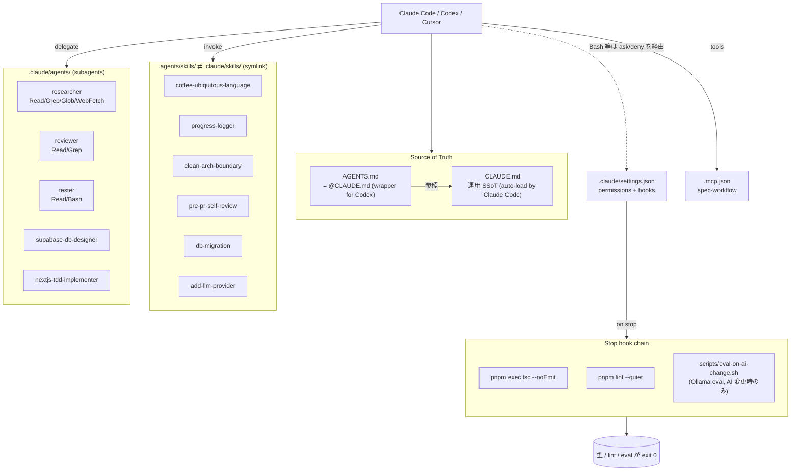

# Agent Onboarding (30 min)

このリポジトリには Claude Code / Codex / Cursor 等の AI コーディングエージェントを安全かつ効率的に運用するための「ハーネス」が組まれている。本書は初見の開発者が **30 分で全体像を掴み、最初のタスク（Hello Harness）に着手できる状態** を目指す。

---

## 1. なぜハーネスがあるのか（120字）

エージェントは自由度が高く、ガードレールが無いと用語逸脱・型負債・破壊的操作をやらかす。ハーネスはガードレールと共通知識を一元化し、再発する事故を構造で防ぐ仕組み。

---

## 2. 全体構成

### 2.1 構成図



### 2.2 各要素の責任（1 行ずつ）

| 要素 | 責任 |
|---|---|
| **CLAUDE.md** | エージェント・人間共通の運用 SSoT（コマンド / 規約 / 禁則 / Claude 固有 / 参照ポインタ）。Claude Code が auto-load する |
| **AGENTS.md** | Codex 等が読む慣習ファイル。`@CLAUDE.md` のみを含む 5 行のラッパー |
| **`.agents/skills/`** | 再現可能ワークフロー（Codex も読む一次格納） |
| **`.claude/skills/`** | `.agents/skills/` への symlink（Claude Code 用参照点） |
| **`.claude/agents/`** | サブエージェント定義（`tools:` で最小権限） |
| **`.claude/settings.json`** | Bash 権限ポリシー + Stop hook 設定 |
| **`scripts/`** | hook helper・一回限りユーティリティ |
| **`.mcp.json`** | MCP サーバ列（現状 `spec-workflow` のみ） |
| **`memory-bank/progress.md`** | 実装ログ（What/Why/Rejected/Next） |
| **`docs/decisions/`** | 設計判断アーカイブ（再迷走防止） |
| **`evals/`** | Ollama ローカル OCR eval ハーネス |

---

## 3. 触れる / 触れないファイル

| 触れていい | 触らない |
|---|---|
| `CLAUDE.md` の Conventions に新規 1 行追加（SSoT） | `next-env.d.ts`（Next.js 自動生成） |
| `.agents/skills/<name>/SKILL.md` 新規・既存改善 | 適用済 `supabase/migrations/*.sql`（不変） |
| `.claude/agents/<name>.md` 新規・既存改善 | `pnpm-lock.yaml`（必ず `pnpm` 経由で更新） |
| `evals/dataset.jsonl` 新規ケース追加 | `.env` / `.env.local` / `secrets/**` |
| `memory-bank/progress.md` 末尾追記 | `tsconfig.json` の `strict` 緩和 |
| `docs/decisions/<date>-<topic>.md` 新規 | `.claude/settings.local.json`（個人ローカル） |

---

## 4. エージェントがミスをしたときのフロー

```
失敗観測
  ↓
既存ハーネスのどこで防げたか確認
  ├── 規約違反 →  CLAUDE.md Conventions に 1 行追加（why 付き）
  ├── 手順抜け →  既存 SKILL に追記、または新規 SKILL
  ├── 機械検出可 → ESLint ルール / Stop hook
  └── 用語ぶれ → docs/UBIQUITOUS_LANGUAGE_DICTIONARY.md 追記
  ↓
同条件で再実行 (再発しないことを確認)
  ↓
PR (chore/harness-improvement-XXX)
  ↓
判断記録 (再迷走しそうなら docs/decisions/)
```

### コード例 1: 「Server Action で revalidate 忘れ」が再発したので SKILL を更新

```diff
# .agents/skills/pre-pr-self-review/SKILL.md
 ## Procedure
 ...
 4. 残骸 (`console.log`, `.only`, `xit`, `debugger`) を grep で検出する。
+5. 変更が `lib/actions/**` を含むなら `revalidatePath` / `revalidateTag` 呼び出しの有無を確認する。
+   なぜ: Server Action で revalidate を忘れ、UI に古いデータが残る事故が再発したため。
 6. `memory-bank/progress.md` に当日エントリがあるか確認する。
```

---

## 5. 起動コマンド

### Claude Code

```bash
# プロジェクトルートで起動（CLAUDE.md / AGENTS.md / .claude/* が自動 load される）
cd /path/to/simple-coffee-collections
claude

# fast モード（軽い質問用、Opus 4.6）
claude --fast

# permissions の確認はスキップしない（推奨デフォルト）
# .claude/settings.json の deny / ask が自動的に効く
```

主要スラッシュコマンド:

```
/help        ヘルプ
/config      設定変更
/schedule    定期実行エージェントの登録
/loop        繰り返し実行
/init        CLAUDE.md 初期化
```

### Codex

```bash
# Codex CLI (OpenAI 公式)
codex
# プロジェクトルートで実行すると AGENTS.md / .agents/skills/ が自動認識される

# IDE 連携 (VS Code 拡張) からも同じ harness を読む
```

両者とも `CLAUDE.md` を SSoT とする（Codex は `AGENTS.md` の `@CLAUDE.md` 参照経由で同内容を取り込む）。Skills は `.agents/skills/` を一次に置き、`.claude/skills/` は symlink なので Claude / Codex 双方から同じ内容を参照する。

---

## 6. アンチパターン警告

### コード例 2: megaskill を 1 ジョブに分解する

❌ Bad: 1 SKILL に「PR 全工程」を詰め込み

```yaml
# .agents/skills/ship-everything/SKILL.md
---
name: ship-everything
description: 機能設計・実装・テスト・PR・リリースまで全部やる
---
```

✅ Good: 関心ごとに分ける

```
.agents/skills/
  pre-pr-self-review/    # 差分とセンサーの確認
  db-migration/          # スキーマ変更
  add-llm-provider/      # provider 拡張
```

### その他のアンチパターン

| アンチパターン | 何が問題か | 対策 |
|---|---|---|
| **megaskill** | 1 SKILL 複数ジョブで適用判断が曖昧化 | 1 SKILL = 1 ジョブ |
| **MCP 積みすぎ** | ツール検索の精度低下、起動時間増 | 必要なものだけ。本リポは `spec-workflow` のみ |
| **CLAUDE.md 500 行超** | auto-load context window 圧迫 | 本リポは 63 行（arch test で ≤120 強制） |
| **「念のため」指示** | リンタの仕事を奪う / ノイズ | 業界標準は CLAUDE.md に書かない |
| **silent disable** | `if: secret != ''` で skip し緑になる | 動かないなら明示的に外す（本リポの evals が CI 不在なのは意図的） |
| **subagent に full Bash 付与** | 想定外コマンド実行リスク | researcher / reviewer は Read+Grep のみ |
| **expected を judge に渡す eval** | reward hacking で score 膨張 | criteria だけで pass/fail（leak 防止） |

---

## 7. Hello Harness タスク

新規メンバーが最初に取り組む練習タスク。**既存の小バグ 1 件をエージェント主導で修正して PR するまで**。

### Step 0: 環境セットアップ

```bash
git clone https://github.com/ifhito/simple-coffee-collections.git
cd simple-coffee-collections
pnpm install
cp .env.example .env.local
# Supabase ローカル起動と環境変数設定は README.md 参照
```

### Step 1: 対象バグを選ぶ

```bash
# 小さめの bug ラベル / good first issue を探す
gh issue list --label bug --state open --limit 10
# 該当が無ければ、UI 文言の typo / 用語違反 (e.g. "レビュー" → "評価") を 1 つ拾う
```

### Step 2: ブランチを切って Claude Code を起動

```bash
git checkout -b fix/hello-harness-<issue-slug>
claude
```

### Step 3: エージェントに依頼（推奨フレーズ）

```
issue #<N> を修正したい。
1. researcher サブエージェントで関連コードを特定（filepath:line citation 必須）
2. 修正方針を提示してもらってから実装
3. 完了したら pre-pr-self-review SKILL を呼んでセルフレビュー
4. progress-logger SKILL で memory-bank/progress.md に追記
```

### Step 4: 自分でセンサー確認（hook が通るか）

```bash
pnpm typecheck
pnpm lint --quiet
pnpm test --testPathPattern=__tests__/architecture
```

### コード例 3: PR 作成までのコマンド

```bash
git add -A
git commit -m "fix: <概要> (refs #<N>)"
git push -u origin fix/hello-harness-<issue-slug>
gh pr create --base main --title "fix: <概要>" --body "$(cat <<'EOF'
## Summary
- (1〜3 行)

## Test plan
- [x] pnpm typecheck
- [x] pnpm lint
- [x] pnpm test

Closes #<N>
EOF
)"
```

### Step 5: ふりかえり

PR 作成後、以下を自問する:

- 今回エージェントは CLAUDE.md / SKILL のどれに従って動いたか？
- 従わなかった or 不足だった部分はあるか？
- あれば「**4. ミスをしたときのフロー**」に従ってハーネスを改善する PR を別途出す

---

## 8. Slack

ハーネス改善・新 SKILL 候補・アンチパターン共有はここ:

`<TODO: Slack channel — 例: #ai-coding。実チャンネル名で置換してマージ>`

新規メンバー歓迎の挨拶もここで。最初の Hello Harness PR を投げたら共有してください。

---

## 9. Required reading

最低この順で目を通してから harness を改修する。

1. **Mitchell Hashimoto — AI agents / Claude Code 運用の文章**
   著者ブログ: https://mitchellh.com/writing
   （"Non-trivial vibe coding" / "On agentic engineering" 等。検索で最新版に当たる）
2. **OpenAI — A Practical Guide to Building Agents**
   検索: "OpenAI A Practical Guide to Building Agents PDF"（公式 cdn.openai.com 配布）
3. **Anthropic — Claude Code 公式ドキュメント**
   https://docs.claude.com/en/docs/claude-code/overview
   （特に "Subagents" / "Hooks" / "Skills" / "MCP" のページ）
4. **Martin Fowler / Birgitta Böckeler — Exploring Gen AI**
   https://martinfowler.com/articles/exploring-gen-ai.html
   （AI-assisted coding の実例とアンチパターンが体系化されている）
5. **HumanLayer — agent harness の設計論**
   https://humanlayer.dev/blog
   （subagent 権限分離・Stop hook の運用例）

> URL は時間と共に変わる可能性がある。404 を踏んだら著者名 + キーワードで再検索し、本ファイルを更新する PR を出す。
